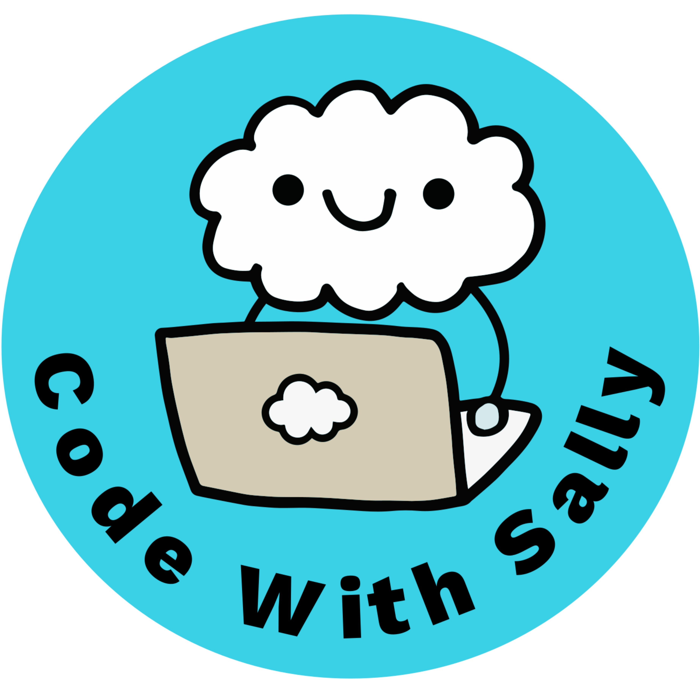
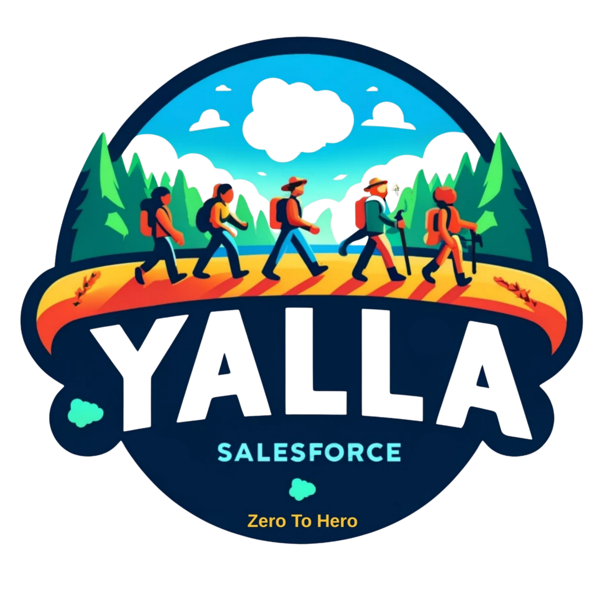

<!-- ============================================================= -->
<!-- LOGOS: replace the two placeholder paths below with your image files. -->
<!-- Put the image files in this same folder (e.g. assets/cws-logo.png). -->
<!-- ============================================================= -->

  <!-- TODO: add Code With Sally logo -->
  
  &nbsp;&nbsp;&nbsp;&nbsp;
  <!-- TODO: add Yalla Salesforce logo -->
  

<h1 align="center">Think Beyond the Code: From Developer to Architect</h1>

  <strong>Dreamforce 2026</strong> · Architect Track 
  Presented by <strong>Sally ElGhoul</strong> (Code With Sally) &amp; <strong>Bassem Ismaiel</strong> (Yalla Salesforce)

---

## 👋 Welcome

You don't flip a switch to become an architect — you **practice it while you're still writing code**.

This page has everything from our session: the eight shifts, the reps you can start Monday, and the best resources to keep growing. Bookmark it — we'll add the **slides (PDF)** and the **session recording** here after Dreamforce.

> **Coming soon to this page:** 📄 Slides (PDF) · 🎥 Session recording

---

## 🎓 Code With Sally

**Code With Sally** is a Salesforce learning platform by Sally ElGhoul — weekly live technical sessions on Salesforce development and AI, in **English and Arabic**, built on real production experience. Practical, honest, mentorship-first.

- 🎥 **YouTube:** https://www.youtube.com/@CodeWithSally
- 📝 **Blog / site:** https://codewithsally.com/
- 💬 **WhatsApp community:** https://chat.whatsapp.com/EDfyHKY9eO53uzqqyMulhP?mode=gi_t
- 💼 **Slack community:** https://join.slack.com/t/codewithsally/shared_invite/zt-1u7djwtms-F~9c67~XDxI3B3a~KRJcoQ
- 🔗 **LinkedIn (page):** https://www.linkedin.com/company/codewithsally/
- 👤 **Sally ElGhoul (LinkedIn):** https://www.linkedin.com/in/sallyelghoul/

**🚀 New series — From Dev to Architect** *(New episodes coming soon!)* — technical architects as guest speakers, each explaining a concept or tool they love:
👉 https://www.youtube.com/playlist?list=PLPNtu86_ZZn0

**🤝 Join our Trailblazer Community Group:**
👉 https://trailhead.salesforce.com/trailblazer-community/groups/0F9KX000000irsF0AQ

---

## 🎓 Yalla Salesforce

**Yalla Salesforce** is Bassem Ismaiel's platform for Salesforce admins and architects — approachable, practical content that helps people level up their Salesforce careers and think architecturally.

- 🎥 **YouTube:** https://www.youtube.com/@YallaSalesforce
- 🔗 **LinkedIn (page):** https://www.linkedin.com/company/yalla-salesforce/

---

## 📚 Official Salesforce architect resources

The best places to keep learning to *think like an architect* — straight from Salesforce:

- **Architecture Center** — the central hub: Well-Architected, diagrams, decision guides, and fundamentals.
  👉 https://architect.salesforce.com/
- **Think Like an Architect** — the livestream/blog series teaching the *What / How / Why* method.
  👉 https://www.salesforce.com/blog/think-like-an-architect/
- **Well-Architected Framework** — the standard for Trusted, Easy, and Adaptable solutions (a great decision validator).
  👉 https://architect.salesforce.com/well-architected
- **Salesforce Diagramming Framework** — how to build clear architecture diagrams (with Lucidchart + the Salesforce shape library).
  👉 https://architect.salesforce.com/diagrams
- **Decision Guides** — trade-off guidance for common architecture choices (integration, data, async, and more).
  👉 https://architect.salesforce.com/decision-guides/
- **Salesforce Architects (YouTube)** — short-form videos and deep dives from the Architecture Program.
  👉 https://www.youtube.com/@SalesforceArchitects
- **Well-Architected (Trailhead module)** — a guided, hands-on intro you can earn a badge for.
  👉 https://trailhead.salesforce.com/content/learn/modules/salesforce-well-architected

---

  <em>Stop asking "can I build it?" — start asking "should we — and will it hold?"</em>

  Made with 💙 by <strong>Code With Sally</strong> &amp; <strong>Yalla Salesforce</strong>

