<!-- _class: title-slide -->

# Separation of Concerns in Apex
### FFLib Series · Session 001

#### Andrew Fawcett
###### Code With Sally


<!--
Main session title. Welcome the audience and set expectations for the FFLib series.
-->

---

<!-- _class: detail-slide about-slide -->

<div class="about-split">
<div class="about-copy">

# About me

##### Independent Salesforce Consultant | Former CPO, Salesforce, Heroku | CTO, FinancialForce.com

* **Independent consultant and architect** — Salesforce platform development, PaaS integrations, and agentic AI
* **Open source and guidance** — creator of DLRS, Apex frameworks, and *Salesforce Platform Enterprise Architecture*
* **Salesforce Customers and Partners Advisory** — architecture and scale, AI-enhanced workflows, org health and codebase mentoring, and ISV product advisory

<!-- -->

* Reduce complexity, unblock engineering, and leave architectures — and teams — able to evolve.

</div>
<div class="about-aside">
<div class="about-logo-wrap">

</div>
<a class="about-book" href="https://www.amazon.com/Salesforce-Platform-Enterprise-Architecture-applications/dp/1804619779">
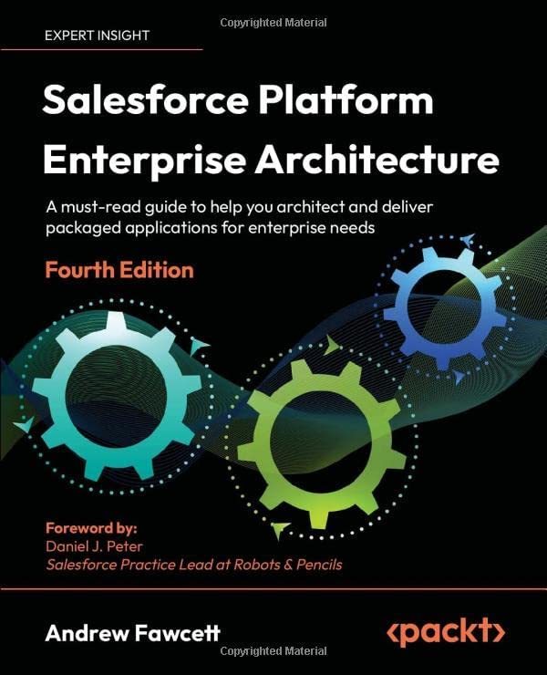
</a>
</div>
</div>

<!--
Andrew Fawcett — AndyInTheCloud. Open-source contributor (DLRS, Apex Enterprise Patterns). Book cover links to Salesforce Platform Enterprise Architecture on Amazon (same as andyinthecloud.com sidebar). Still blogs and speaks at community events. Offer to connect after the session if they want to talk platform strategy or architecture.
-->

---

<!-- _class: detail-slide history-slide -->

# fflib — a brief history

* **Early ISV (2009)** — FinancialForce.com (ff); enterprise heritage (C, Java)
* **Motivation** — repeatable structure for large Apex codebases
* **`fflib-apex-common`** — Service, Domain, Selector, Unit of Work
* **`fflib-apex-mocks`** — Stub API for isolated tests
* **Adoption** — used by many larger enterprise orgs, partner SIs and ISVs
* **Today** — Launching brand new documentation site

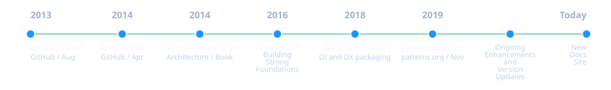

<!--
Verified dates (GitHub API / Packt): fflib-apex-common repo 27 Aug 2013; fflib-apex-mocks 30 Apr 2014; Force.com Enterprise Architecture 1st ed Sep 2014; force-di 6 Jul 2018; AT4DX 17 Aug 2018; apex-enterprise-patterns GitHub org 15 Nov 2019 (community team, move off FF repos). FinancialForce.com launched 30 Sep 2009 (Reuters / Salesforce–Unit4 JV); precursor Coda2go on Force.com Dec 2008. Patterns debuted Dreamforce 2012. Walk the timeline at the bottom.
-->

---

<!-- _class: detail-slide contributors-slide -->

# fflib — core contributors

<div class="contributors">
<figure>

<figcaption><strong>John M. Daniel</strong><span>Senior Director of Digital Platforms</span><span>Steampunk, Inc.</span><span class="love">❤️ Jeeps</span></figcaption>
</figure>
<figure>

<figcaption><strong>John Storey</strong><span>Staff Software Engineer</span><span>Thrivent</span><span class="love">❤️ General Aviation</span></figcaption>
</figure>
<figure>

<figcaption><strong>David Esposito</strong><span>SVP Engineering</span><span>Leap Event Technology</span><span class="love">❤️ Taking things apart</span></figcaption>
</figure>
<figure>

<figcaption><strong>Andrew Fawcett</strong><span>CEO</span><span>AndyInTheCloud Consulting Ltd</span><span class="love">❤️ Lego and retro computing</span></figcaption>
</figure>
<figure>

<figcaption><strong>Matt Gerry</strong><span>Salesforce CTA</span><span>Coding With The Force</span><span class="love">❤️ Retro computers and consoles</span></figcaption>
</figure>
</div>

<!--
The people who keep fflib alive. John Daniel and John Storey curate the libraries. David Esposito is a long-time mocks and common contributor. Andrew started the patterns. Matt Gerry — Salesforce CTA and founder of Coding With The Force — wrote the video series many teams still learn from. Thank them.
-->

---

<!-- _class: detail-slide -->

# fflib — what's evolved

* **Domains** — can be just behavior / task / operation methods
* **Sidecar trigger handlers** — fine for object logic related to CRUD
* **Combined domains** — still fine if they do both
* **Services** — now prefer instance methods over static
* **Selectors** — don't need every field; just the common ones
* **Feature selectors** — can be feature-specific, not only object-centric
* **Application class** — optional; mocking can be done without it - <a href="https://andyinthecloud.com/2026/04/13/apex-enterprise-patterns-recent-updates-and-thoughts-on-the-application-class/">blog</a>
* **Apex interfaces** — now recommended only for dependency injection
* **fflib-apex-mocks** — no longer a dependency

<!--
Relaxations since the original patterns. Domain can be operations-only, a sidecar CRUD handler, or both. Service methods now prefer instance methods over static. Selectors are not god-objects and can be feature-shaped. Application factory is optional — the Application class bullet links to the April 2026 andyinthecloud post. Apex interfaces are now recommended only for dependency injection. fflib-apex-mocks is no longer a dependency.
-->

---

<!-- _class: detail-slide picture-slide -->

<div class="polaroid">

<span class="polaroid-caption">What is wrong with this picture?</span>
</div>

<!--
Warm-up from Building Strong Foundations. The fridge looks fine until you notice the cat — same idea as Apex that “works” until a second entry point shows up.
-->

---

<!-- _class: detail-slide code-slide duo-slide sample-note-slide -->

# What's wrong with this picture?

<div class="duo">
<div class="duo-col">
<p class="dev-caption">👤 Developer “A” — creates a controller</p>
<div class="vscode">
<div class="vscode-tabs"><span class="vscode-tab vscode-tab-client">OpportunityCreateInvoiceController.cls</span></div>

```apex
public inherited sharing class OpportunityCreateInvoiceController {
  @AuraEnabled(cacheable=false)
  public static Id createInvoice(
      Id opportunityId, Decimal discountPercentage) {
    try {
      Opportunity opportunity = [
        SELECT Id, AccountId, CloseDate, Description,
          (SELECT Id, UnitPrice, Quantity,
             PricebookEntry.Product2Id, …
           FROM OpportunityLineItems)
        FROM Opportunity WHERE Id = :opportunityId
      ];

      // optional discount logic …
      Invoice__c invoice = new Invoice__c();
      // set invoice fields …
      insert invoice;
      for (OpportunityLineItem line : opportunity.OpportunityLineItems) {
        // build invoice lines …
      }
      insert allLines;
      return invoice.Id;
    } catch (Exception e) {
      throw new AuraHandledException(e.getMessage());
    }
  }
}
```

</div>
</div>
<div class="duo-col">
<p class="dev-caption">👤 Developer “B” — later creates a batch job</p>
<div class="vscode">
<div class="vscode-tabs"><span class="vscode-tab vscode-tab-client">CreateInvoicesJob.cls</span></div>

```apex
public inherited sharing class CreateInvoicesJob
    implements Database.Batchable<SObject>, … {
  private List<Exception> exceptions = new List<Exception>();

  public void execute(
      Database.BatchableContext context,
      List<Opportunity> opps) {
    for (Opportunity opp : opps) {
      try {
        OpportunityCreateInvoiceController
            .createInvoice(opp.Id, 0);
      } catch (Exception e) {
        exceptions.add(e);
      }
    }
  }

  public Database.QueryLocator start(…) { /* … */ }
  public void finish(…) { /* … */ }
}
```

</div>
</div>
</div>

<p class="sample-note">Code samples are reduced. Missing variables are not what’s wrong. Samples assume user mode, API 67.0.</p>

<!--
Both sides are force-app.without-soc. Developer A put invoice SOQL, mapping, and DML in the controller. Developer B needed batch invoicing — and called that controller once per record in execute.

It compiles and looks like reuse — but each call runs its own query and DML, and the business operation still lives in UI-shaped Apex.
-->

---

<!-- _class: detail-slide issue-slide issue-slide-single -->

# So what was wrong with that picture?

<div class="issue-block">
<p class="issue-who">Developer “A” — OpportunityCreateInvoiceController</p>
<table>
<thead><tr><th>OpportunityCreateInvoiceController</th><th>Issue</th></tr></thead>
<tbody>
<tr><td>Business Logic Misplaced</td><td>Logic such as this should be client agnostic.</td></tr>
<tr><td>Error Handling</td><td>Risk of partial updates as request will still commit.</td></tr>
</tbody>
</table>
</div>

<div class="issue-block">
<p class="issue-who">Developer “B” — CreateInvoicesJob</p>
<table>
<thead><tr><th>CreateInvoicesJob</th><th>Issue</th></tr></thead>
<tbody>
<tr><td>Controller Logic Reuse</td><td>Controller logic not written to be reused elsewhere.</td></tr>
<tr><td>Error Handling</td><td>Exceptions being logged are UI exceptions.</td></tr>
<tr><td>Bulkification</td><td>Indirect bulkification issue.</td></tr>
</tbody>
</table>
</div>

<!--
Walk Developer A first: business logic lives in a Lightning controller — not client agnostic; partial-update risk if the request commits before the catch. Then Developer B: reusing UI-shaped controller from batch; caught exceptions are AuraHandledException from the controller; one createInvoice call per record — indirect bulkification failure.
-->

---

<!-- _class: detail-slide code-slide compact-code-slide -->

# What's wrong with this picture?

<div class="vscode">
<div class="vscode-tabs"><span class="vscode-tab vscode-tab-client">opportunityApplyDiscount.js</span></div>

```javascript
import { getRecord, getFieldValue, updateRecord } from "lightning/uiRecordApi";
import { getRelatedListRecords } from "lightning/uiRelatedListApi";
import DISCOUNT_TYPE_FIELD from "@salesforce/schema/Opportunity.DiscountType__c";

export default class OpportunityApplyDiscount extends LightningElement {
  @wire(getRecord, { recordId: "$recordId", fields: OPP_FIELDS })
  wiredOpportunity;
  @wire(getRelatedListRecords, {
    parentRecordId: "$recordId", relatedListId: "OpportunityLineItems", …
  })
  wiredLineItems;

  async handleApply() {
    const factor = 1 - (this.discountPercentage / 100);
    const discountType = getFieldValue(this.wiredOpportunity.data, DISCOUNT_TYPE_FIELD);
    const updates = [];

    for (const line of this.wiredLineItems.data.records) {
      const approved = …Product2.DiscountingApproved__c;
      if (discountType === "Approved Products" && !approved) continue;
      updates.push({
        fields: { Id: line.id, UnitPrice: line.fields.UnitPrice.value * factor }
      });
    }
    await Promise.all(updates.map((r) => updateRecord(r)));
  }
}
```

</div>

<!--
Anti-pattern: LDS loads the data, but discount factor, approved-product skip, and updateRecord all live in the LWC controller — no Apex service. Same rules are duplicated in OpportunityApplyDiscountController for VF. Ask: what happens when Flow, REST, or an Agent Action needs the same rule?
-->

---

<!-- _class: detail-slide issue-slide issue-slide-single -->

# So what was wrong with that picture?

<div class="issue-block">
<p class="issue-who">opportunityApplyDiscount.js</p>
<table>
<thead><tr><th>opportunityApplyDiscount</th><th>Issue</th></tr></thead>
<tbody>
<tr><td>Business Logic Misplaced</td><td>Discount rules live in JavaScript — not client agnostic.</td></tr>
<tr><td>Reuse</td><td>Flow, REST, and Agent Actions cannot call this implementation.</td></tr>
<tr><td>Error Handling</td><td><code>Promise.all</code> with <code>updateRecord</code> — partial updates may still commit.</td></tr>
</tbody>
</table>
</div>

<!--
Walk the table: LDS is fine for reads/writes, but the business rule belongs in Apex. VF list button already has a second copy. Poll: where would they put apply discount for an Agent Action?
-->

---

<!-- _class: detail-slide code-slide compact-code-slide -->

# What's wrong with this picture?

<div class="vscode">
<div class="vscode-tabs"><span class="vscode-tab vscode-tab-client">CreateInvoice.cls</span></div>

```apex
public inherited sharing class CreateInvoice {
  @InvocableMethod(label='Create Invoice', …)
  public static List<Result> execute(List<Request> requests) {
    Set<Id> opportunityIds = …; // from requests
    Map<Id, Opportunity> opportunities = [ … WHERE Id IN :opportunityIds ];
    Map<Id, Invoice__c> invoicesByOpportunityId = new Map<Id, Invoice__c>();
    Map<Id, List<InvoiceLine__c>> linesByOpportunityId = new Map<Id, List<InvoiceLine__c>>();
    for (Request request : requests) {
      Opportunity opportunity = opportunities.get(request.opportunityId);
      Decimal discountFactor = …; // from request.discountPercentage
      invoicesByOpportunityId.put(request.opportunityId, new Invoice__c(…));
      List<InvoiceLine__c> lines = new List<InvoiceLine__c>();
      for (OpportunityLineItem lineItem : opportunity.OpportunityLineItems) {
        lines.add(new InvoiceLine__c(UnitPrice__c = … * discountFactor, …));
      }
      linesByOpportunityId.put(request.opportunityId, lines);
    }
    insert invoicesByOpportunityId.values();
    List<InvoiceLine__c> allLines = new List<InvoiceLine__c>();
    for (Id oppId : linesByOpportunityId.keySet()) {
      // wire each line to its invoice Id, add to allLines
    }
    insert allLines;
    List<Result> results = …; // compose results
    return results;
  }
}
```

</div>

<!--
Same business operation, third copy. Agent Actions and Flow should call the same operation as buttons and APIs — not reimplement it.
-->

---

<!-- _class: detail-slide issue-slide issue-slide-single -->

# So what was wrong with that picture?

<div class="issue-block">
<p class="issue-who">CreateInvoice.cls</p>
<table>
<thead><tr><th>CreateInvoice</th><th>Issue</th></tr></thead>
<tbody>
<tr><td>Business Logic Misplaced</td><td>Creation of the Invoice and apply discount is not the job of this class.</td></tr>
<tr><td>Complexity</td><td>Actual business logic is hidden due to query, transformation and DML logic.</td></tr>
</tbody>
</table>
</div>

<!--
Walk the table: an invocable should map Flow inputs/outputs — not own invoice creation or discount rules. Point at the maps and wiring loops on the previous slide — the real story is buried in transformation plumbing that belongs elsewhere.
-->

---

<!-- _class: detail-slide -->

# Lack of SoC is not just a reuse problem

* 🤔 How would **you** expose **“apply discount”** and **“create invoice”** as an **API**?
* 🤔 How would **you** call it from a **React** app?
* 🤔 How would **you** wire it to an **Agent Action** or **Flow**?
* ⚠️ If you have this problem — your app is not ready to embrace change
* ⚠️ Duplication is not the real problem — **code base durability** is
* ❤️ Your business logic is **the** most important logic of your app

<!--
Audience exercise. SoC is about stable homes for behavior, not only DRY. Poll the room: where does the rule live today in their org? Point at the three anti-patterns just shown — the real cost is keeping critical rules correct as clients and teams change.
-->

---

<!-- _class: detail-slide diagram-slide evolve-slide -->

# How durable is your code when change occurs?

<p class="evolve-subtext">How users interact with your application changes a lot — protect against it with SoC</p>

<div class="evolve-layout">
<div class="evolve-spacer" aria-hidden="true"></div>
<div class="evolve-stack">
<div class="timeline timeline-impact">
<div class="timeline-row">
<span class="t-node">VF</span>
<span class="t-bridge"><span class="t-line"></span><span class="t-icon">🤔</span></span>
<span class="t-node">Aura</span>
<span class="t-bridge"><span class="t-line"></span><span class="t-icon">🤔</span></span>
<span class="t-node">LWC</span>
<span class="t-bridge"><span class="t-line"></span><span class="t-icon">🤔</span></span>
<span class="t-node">Agent Action</span>
<span class="t-bridge"><span class="t-line"></span><span class="t-icon">🤔</span></span>
<span class="t-node">React</span>
<span class="t-bridge"><span class="t-line"></span><span class="t-icon">🤔</span></span>
<span class="t-node">Next?</span>
</div>
<p class="timeline-legend">🤔 Business Logic Impact</p>
</div>
<div class="vscode evolve-copy">
<div class="vscode-tabs"><span class="vscode-tab vscode-tab-client">OpportunityController.cls</span><span class="vscode-tab vscode-tab-alt vscode-tab-client">OpportunityInvocable.cls</span><span class="vscode-tab vscode-tab-alt vscode-tab-client">InvoiceController.cls</span><span class="vscode-tab vscode-tab-alt vscode-tab-client">InvoiceInvocable.cls</span></div>
<pre><code>// logic copied — every new client type
VF · Aura · LWC · Agent Action · React · Next?
  └─► OpportunityController.applyDiscount(...)
  └─► OpportunityInvocable.applyDiscount(...)
  └─► InvoiceController.createInvoice(...)
  └─► InvoiceInvocable.createInvoice(...)</code></pre>
</div>
<div class="timeline timeline-service">
<div class="timeline-row">
<span class="t-node">VF</span>
<span class="t-bridge t-bridge-heart"><span class="t-line"></span><span class="t-icon">❤️</span></span>
<span class="t-node">Aura</span>
<span class="t-bridge t-bridge-heart"><span class="t-line"></span><span class="t-icon">❤️</span></span>
<span class="t-node">LWC</span>
<span class="t-bridge t-bridge-heart"><span class="t-line"></span><span class="t-icon">❤️</span></span>
<span class="t-node">Agent Action</span>
<span class="t-bridge t-bridge-heart"><span class="t-line"></span><span class="t-icon">❤️</span></span>
<span class="t-node">React</span>
<span class="t-bridge t-bridge-heart"><span class="t-line"></span><span class="t-icon">❤️</span></span>
<span class="t-node">Next?</span>
</div>
</div>
<div class="vscode evolve-services">
<div class="vscode-tabs"><span class="vscode-tab vscode-tab-service">OpportunityService.cls</span><span class="vscode-tab vscode-tab-alt vscode-tab-service">InvoiceService.cls</span></div>
<pre><code>// same services — every client type
LWC · REST · Batch · Flow · Agent Action · Next?
  └─► OpportunityService.applyDiscount(...)
  └─► InvoiceService.createInvoice(...)</code></pre>
</div>
</div>
<div class="evolve-footer">
<p class="evolve-tagline">❤️ Your business logic is <strong>the</strong> most important logic in your app — and when it's everywhere, it becomes a <strong>significant investment risk</strong></p>
</div>
</div>

<!--
Top timeline: each new client copied business logic — Business Logic Impact every step; IDE panel shows duplicated Controller and Invocable classes. Bottom timeline: one service layer, hearts not warnings; same IDE pattern with OpportunityService and InvoiceService. Ask what is next for their org.
-->

---

<!-- _class: detail-slide quote-slide -->

# So what is “Separation of Concerns” then?

<blockquote>
Separation of concerns (SoC) is a design principle in computer science and software engineering; it holds that a complex problem should be divided into distinct concerns — aspects or issues — that can be analyzed, addressed or managed individually, even when they belong to the same system. This allows focusing on one issue at a time, reducing cognitive load and complexity.
</blockquote>

<p class="quote-source"><a href="https://en.wikipedia.org/wiki/Separation_of_concerns">Wikipedia, “Separation of Concerns”</a> <em>(as at 2025)</em></p>

<!--
Read it slowly. Distinct concerns, one issue at a time, cognitive load. That is why the trigger only delegates, and why Developer B should not have to construct a Visualforce controller.
-->

---

<!-- _class: detail-slide quote-slide -->

# So what is “DRY” then?

<p class="acronym">Don’t Repeat Yourself</p>

<blockquote>
Every piece of knowledge must have a single, unambiguous, authoritative representation within a system.
</blockquote>

<p class="quote-source"><a href="https://en.wikipedia.org/wiki/Don%27t_repeat_yourself">Wikipedia, Don&rsquo;t repeat yourself (DRY)</a></p>

<!--
SoC says where a concern lives. DRY says it lives once. If the rule is in the trigger, the batch, and the LWC, it is not DRY and it is not separated.
-->

---

<!-- _class: detail-slide layers-slide -->

# Design Patterns for SoC and Force.com

<div class="layers-split">
<ul>
<li><strong>Service Layer</strong> — one place for application operations</li>
<li><strong>Domain Layer</strong> — behaviour that is true of the object<br><em>(yet another wrapper / trigger pattern)</em></li>
<li><strong>Selector Layer</strong> — one place for SOQL</li>
<li>Martin Fowler — <a href="https://martinfowler.com/eaaCatalog/">Patterns of Enterprise Application Architecture</a></li>
</ul>
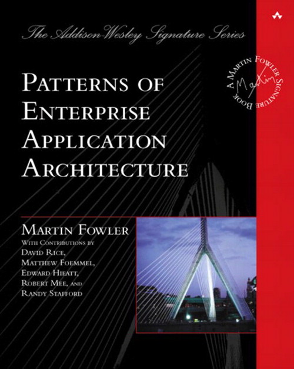
</div>

<!--
Fowler named Service, Domain, and data-access patterns. fflib maps them onto Salesforce: Service for the operation, Domain for the object, Selector for the query.
-->

---

<!-- _class: detail-slide sample-code-slide -->

# Sample Code - Buttons and Lightning UIs

<div class="sample-code-layout">
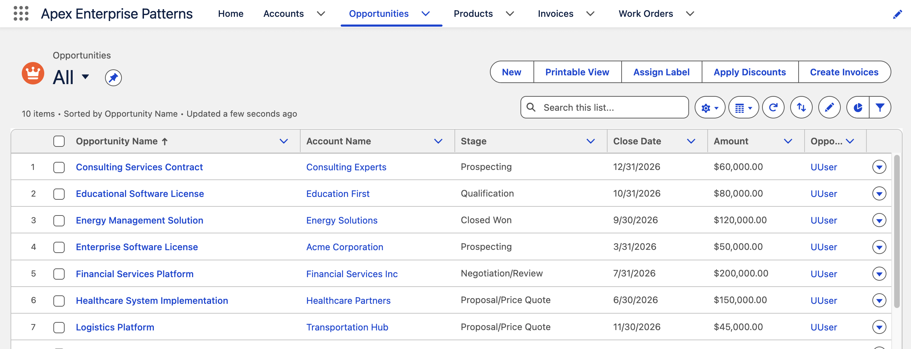
<div class="sample-code-row">
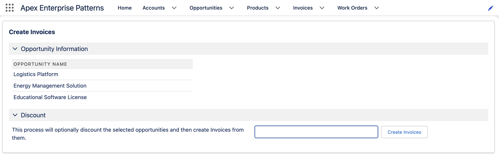
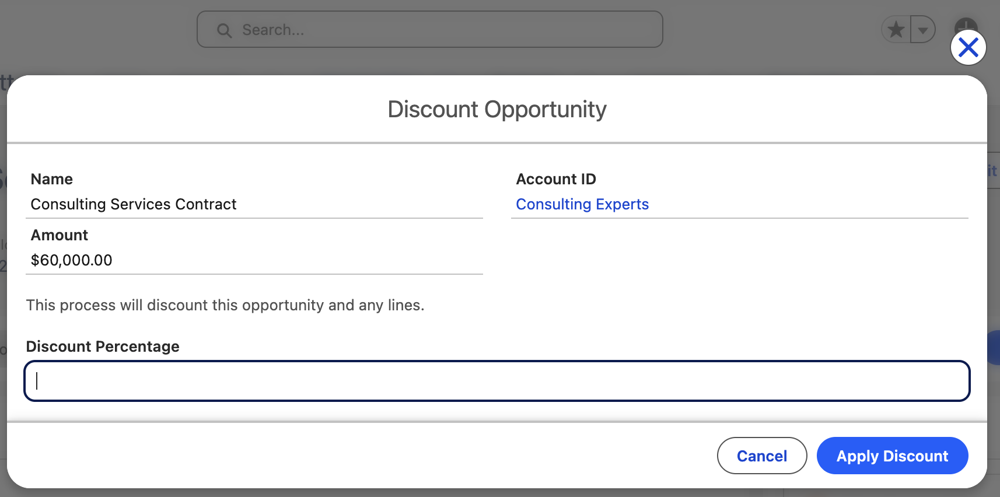
</div>
</div>

<!--
Same demo app in the with-soc org: list actions and record flows the audience just saw opened. Walk Apply Discount vs Create Invoices as two entry points into the same service layer.
-->

---

<!-- _class: detail-slide terminal-slide -->

# Sample Code - REST and AgentForce

<div class="terminal-agent-split">
<div class="terminal">
<div class="terminal-bar"><span class="terminal-lights"></span><span class="terminal-title">zsh</span></div>
<pre class="terminal-body"><span class="term-prompt">$</span> sf api request rest \
  '/services/apexrest/opportunities/006Ru00000VQICNIA5/applydiscount?discount=10' \
  --method POST --include \
  --target-org session001-soc \
  --body '{}'

<span class="term-ok">HTTP/1.1 200</span></pre>
</div>
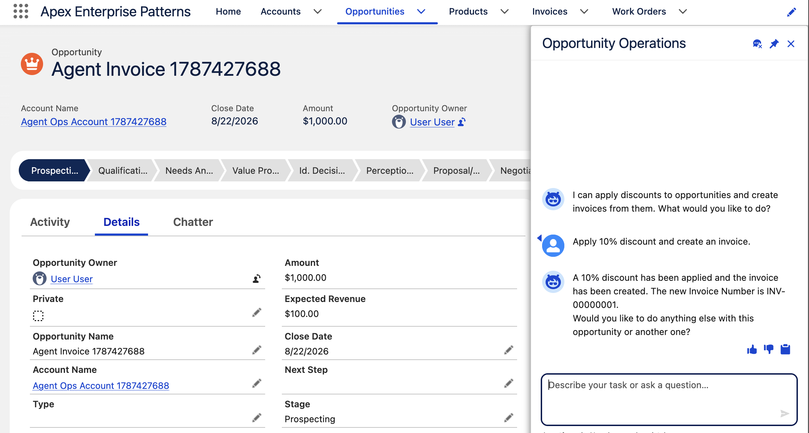
</div>

<!--
Same apply-discount and create-invoice operations as the UI buttons — REST via OpportunitiesResource, and the Opportunity Operations employee agent on the record page. Both delegate to OpportunitiesService. Empty 200 body is expected: the Apex REST method is void.
-->

---

<!-- _class: detail-slide sample-code-compare-slide -->

# Sample Code

<div class="sample-code-compare">
<div class="sample-code-panel">
<span class="sample-code-label">Without SOC</span>
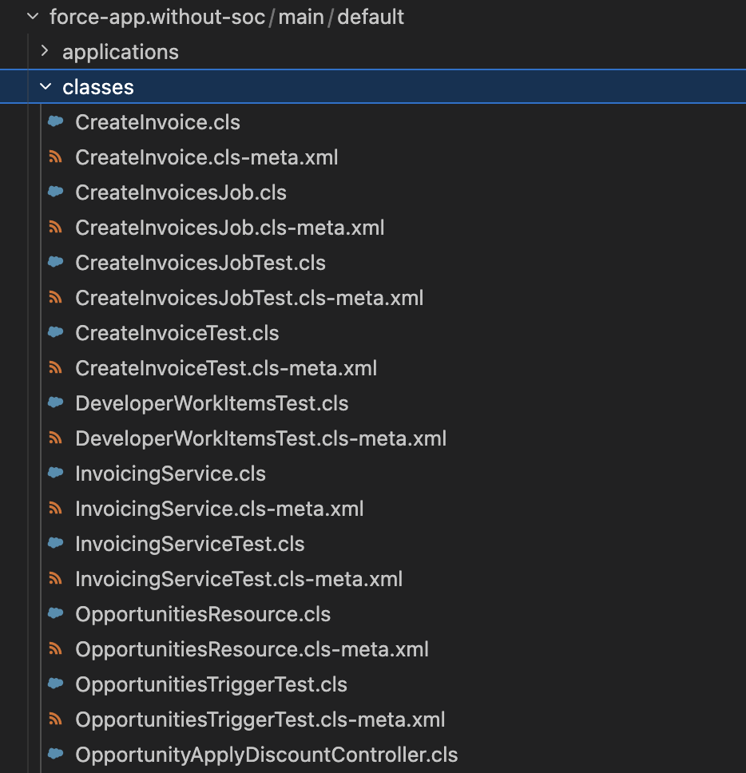
</div>
<div class="sample-code-panel">
<span class="sample-code-label">With SOC</span>
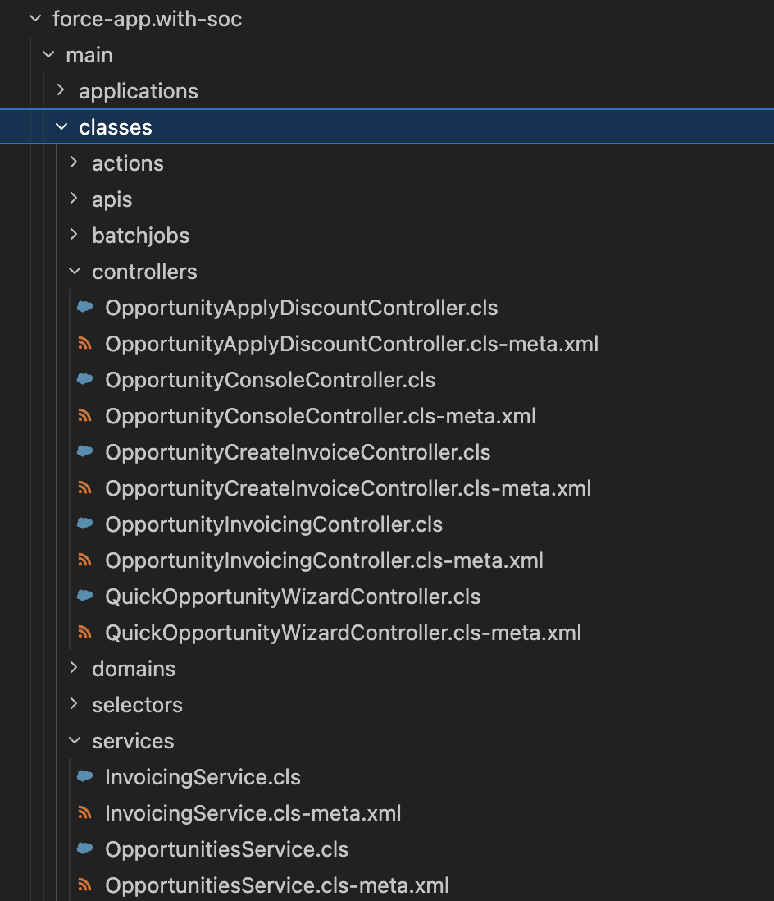
</div>
</div>
<p class="sample-note" data-marpit-fragment><strong>Vanilla SoC</strong><br>You don't need a library or tooling to follow SoC — so for now neither of these samples use fflib or other libraries. Later in this series we apply fflib over the SoC sample and highlight the value along the way.</p>

<!--
Same demo app, two packages. Left: everything in one classes folder. Right: controllers, services, selectors, domains, and the rest separated by concern. Neither uses fflib or another library. Later sessions layer fflib onto the with-SoC sample and show the value as we go.
-->

---

<!-- _class: detail-slide -->

# Sample Code - Platform Features

* **Buttons** — Apply Discount, Create Invoice, Quick Opportunity...
* **Triggers** — defaults, validation, related Account activity
* **Batch** — Create Invoices job
* **Invocable** — Create Invoice (Flow / Agent Action)
* **Agentforce** — Apply discounts and create invoices
* **REST** — Opportunities resource

<!--
Live demo or narrated walkthrough. Show the same user journeys on both packages where useful.
-->

---

<!-- _class: detail-slide checklist-slide -->

# Pattern Checklist


<ul class="checklist">
<li>Pattern Checklist</li>
<li>Separation of Concerns<span class="check"></span></li>
<li>Service Layer<span class="check"></span></li>
<li>Domain Layer<span class="check"></span></li>
<li>Selector Layer<span class="check"></span></li>
</ul>

<!--
From Building Strong Foundations — the four boxes we tick across the session. SoC is why the patterns exist; Service, Domain, and Selector are how we split them.
-->

---

<!-- _class: detail-slide diagram-slide layers-diagram-slide -->

# Salesforce Platform SOC Layers

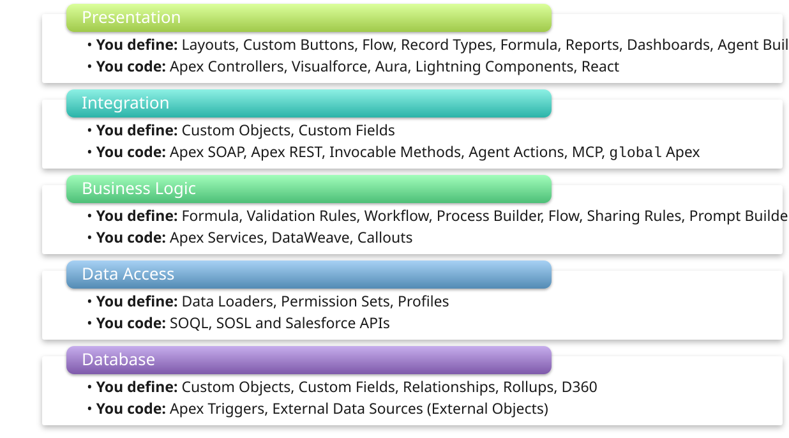

<!--
Every layer has declarative and coding paths. SoC is putting each concern in the right layer. Walk top to bottom; note external clients alongside LWC and Flow.
-->

---

<!-- _class: detail-slide diagram-slide layers-diagram-slide layers-classes-slide -->

# Suggested Class Folder Layout

<div class="soc-layers">
<div class="soc-layer soc-layer-presentation">
<div class="soc-layer-header">Presentation</div>
<div class="vscode">
<div class="vscode-tabs"><span class="vscode-tab vscode-tab-client">OpportunityCreateInvoiceController.cls</span><span class="vscode-tab vscode-tab-alt vscode-tab-client">OpportunityApplyDiscountController.cls</span><span class="vscode-tab vscode-tab-alt vscode-tab-client">OpportunityInvoicingController.cls</span><span class="vscode-tab vscode-tab-alt vscode-tab-more">…</span></div>
<div class="vscode-pane"><span class="vscode-comment">// /classes/controllers</span></div>
</div>
</div>
<div class="soc-layer soc-layer-integration">
<div class="soc-layer-header">Integration</div>
<div class="vscode">
<div class="vscode-tabs"><span class="vscode-tab vscode-tab-client">ApplyDiscount.cls</span><span class="vscode-tab vscode-tab-alt vscode-tab-client">CreateInvoice.cls</span><span class="vscode-tab vscode-tab-alt vscode-tab-client">OpportunitiesResource.cls</span></div>
<div class="vscode-pane"><span class="vscode-comment">// /classes/actions · /classes/apis</span></div>
</div>
</div>
<div class="soc-layer soc-layer-business">
<span class="soc-layer-heart">❤️</span>
<div class="soc-layer-header">Business Logic</div>
<div class="soc-layer-windows">
<div class="vscode">
<div class="vscode-tabs"><span class="vscode-tab vscode-tab-service">OpportunitiesService.cls</span><span class="vscode-tab vscode-tab-alt vscode-tab-service">InvoicingService.cls</span></div>
<div class="vscode-pane"><span class="vscode-comment">// /classes/services</span></div>
</div>
<div class="vscode">
<div class="vscode-tabs"><span class="vscode-tab vscode-tab-domain">Opportunities.cls</span><span class="vscode-tab vscode-tab-alt vscode-tab-domain">OpportunityLineItems.cls</span><span class="vscode-tab vscode-tab-alt vscode-tab-domain">Accounts.cls</span><span class="vscode-tab vscode-tab-alt vscode-tab-more">…</span></div>
<div class="vscode-pane"><span class="vscode-comment">// /classes/domains</span></div>
</div>
<div class="vscode">
<div class="vscode-tabs"><span class="vscode-tab vscode-tab-domain">OpportunitiesTriggerHandler.cls</span></div>
<div class="vscode-pane"><span class="vscode-comment">// /classes/triggerHandlers</span></div>
</div>
</div>
</div>
<div class="soc-layer soc-layer-data">
<div class="soc-layer-header">Data Access</div>
<div class="vscode">
<div class="vscode-tabs"><span class="vscode-tab vscode-tab-selector">OpportunitiesSelector.cls</span><span class="vscode-tab vscode-tab-alt vscode-tab-selector">OpportunityLineItemsSelector.cls</span><span class="vscode-tab vscode-tab-alt vscode-tab-selector">AccountsSelector.cls</span><span class="vscode-tab vscode-tab-alt vscode-tab-selector">ProductsSelector.cls</span></div>
<div class="vscode-pane"><span class="vscode-comment">// /classes/selectors</span></div>
</div>
</div>
<div class="soc-layer soc-layer-database">
<div class="soc-layer-header">Database</div>
<div class="vscode">
<div class="vscode-tabs"><span class="vscode-tab vscode-tab-domain">OpportunitiesTriggerHandler.cls</span></div>
<div class="vscode-pane"><span class="vscode-comment">// /classes/triggerHandlers</span></div>
</div>
</div>
</div>

<!--
Same five platform layers as the previous slide — now with with-soc sample class names. Controllers in Presentation, invocables and REST in Integration, services then domain then handlers in Business Logic, selectors in Data Access, trigger handler in Database.
-->

---

<!-- _class: detail-slide diagram-slide testing-triangle-slide -->

# The Testing Triangle loves SOC

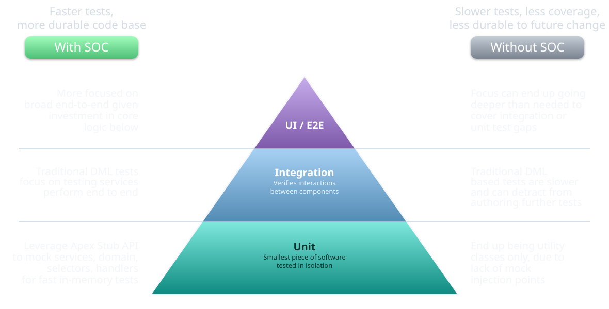

<!--
Classic testing pyramid. Unit (Fowler / ISTQB): smallest piece of software, tested in isolation. Integration: verifies interactions between components. With SoC the unit band is real unit tests via mocking. Without SoC you cannot isolate, so those tests are effectively integration tests.
-->

---

<!-- _class: detail-slide quote-slide quote-statement-slide -->

<blockquote>
Separation of Concerns is a requirement to build well-factored, durable and lasting applications — regardless of fflib or other library support.
</blockquote>

<!--
SoC is the requirement; fflib is one way to honour it. The principle stands if they use another library or none at all.
-->

---

<!-- _class: detail-slide checklist-slide -->

# Pattern Checklist


<ul class="checklist">
<li>Pattern Checklist</li>
<li>Separation of Concerns<span class="check">✅</span></li>
<li>Service Layer<span class="check"></span></li>
<li>Domain Layer<span class="check"></span></li>
<li>Selector Layer<span class="check"></span></li>
</ul>

<!--
Transition into Service Layer section. SoC is ticked — now we implement the split.
-->

---

<!-- _class: detail-slide service-conductor-slide -->

# Service ➡️ Task Orientated Logic

* A Service represents a **feature** of the application
  * Invoicing — `InvoicingService.cls`
  * Opportunity Discounting — `OpportunitiesService.cls` or `OpportunitiesDiscountService.cls`
* Each method is a **task** within that feature — `applyDiscounts`, `createInvoices`, or `submitJob`
* Think of it as the **conductor** — the band handles querying and object-specific logic; the Service sets the tempo and the rules of the orchestration

<div class="conductor-graphic">
  
  <p class="conductor-caption"><span>Tasks in front</span><span>Service — the conductor</span><span>The band — querying and object-specific logic</span></p>
</div>

<!--
Feature then task, then the conductor. This repo uses OpportunitiesService; OpportunitiesDiscountService is the equally valid feature-named alternative. Picture: conductor is the Service; the band behind is querying and object-specific logic; tasks sit in front.
-->

---

<!-- _class: detail-slide diagram-slide -->

# Services have many Consumers

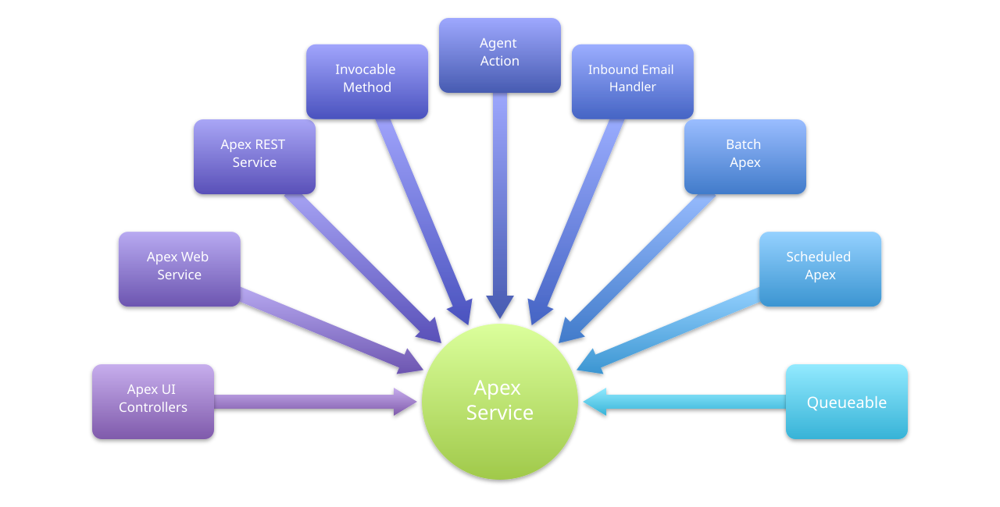

<!--
Same service, many clients. Trigger, LWC, batch, Flow invocable, REST, and Agent Action should call one OpportunitiesService — not each copy the rules.
-->

---

<!-- _class: detail-slide promises-slide -->

# Service ☑️ Checklist

* Client-agnostic inputs and outputs
  * ✅ `applyDiscounts(Set<Id> opportunityIds, Decimal discountPercentage)`
  * ❌ `applyDiscount(ApplyInputForm form)`
* Client-agnostic exceptions
  * ✅ `throw OpportunitiesServiceException`
  * ❌ `throw AuraHandledException`
* **Bulkification** — collections in and out; don't force callers to loop
  * ✅ `createInvoices(Set<Id> opportunityIds)`
  * ❌ `createInvoice(Opportunity id)`
* **Transactions** — rollback on error; avoid partial commits; optional outer txn
* **Security** — user mode; elevates to system internally as needed

<!--
Ids and primitives are client-agnostic. A UI-shaped ApplyInputForm couples the service to one caller. This repo uses the Set<Id> overload. AuraHandledException is a Lightning type — wrap it at the controller, not in the service. Bulkification: one service call takes the set; a single-Opportunity method forces every caller to loop. Transaction: rollback on error so callers never see a partial commit; a service method can join an optional outer transaction when a caller already started one.
-->

---

<!-- _class: detail-slide code-slide -->

# Service - Code Example

<div class="vscode">
<div class="vscode-tabs"><span class="vscode-tab vscode-tab-service">OpportunitiesService.cls</span></div>

```apex
public void applyDiscounts(
    Set<Id> opportunityIds, Decimal discountPercentage) {
  Savepoint sp = Database.setSavepoint();
  try {
    Opportunities opportunities = Opportunities.newInstance(
        selector.selectByIdWithProducts(opportunityIds));
    opportunities.applyDiscount(discountPercentage);
    Database.update(opportunities.getRecords());
  } catch (Exception e) {
    Database.rollback(sp);
    throw new OpportunitiesServiceException(e.getMessage(), e);
  }
}
```

</div>

<!--
Walk applyDiscounts: client-agnostic Set<Id>, selector loads with products, domain applies the discount in memory, service commits via getRecords. One catch rolls back and wraps OpportunitiesServiceException. Same method for controller, REST, batch, and invocable.
-->

---

<!-- _class: detail-slide diagram-slide -->

# Service - Consumers and Dependencies

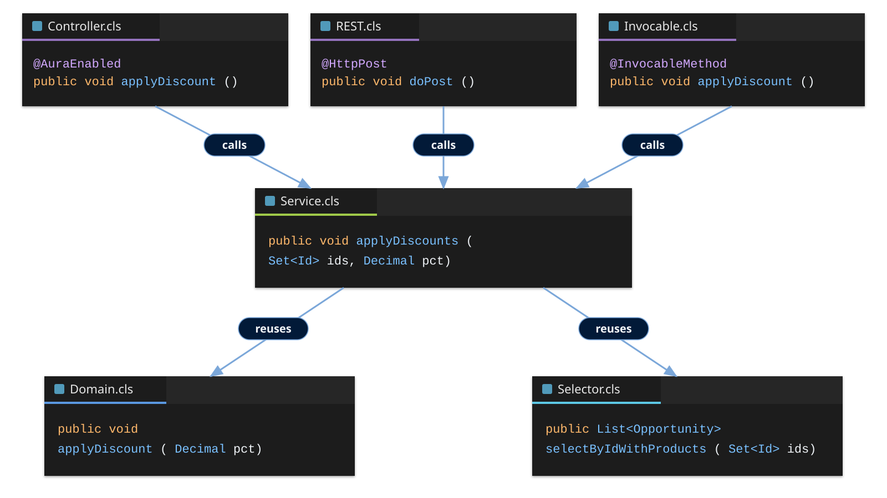

<!--
Service is the hub. Controller, REST, Invocable, and Trigger call the same applyDiscounts. Service then reuses Domain (in-memory discount) and Selector (SOQL). Same collaboration for every consumer — no copy of the rules.
-->

---

<!-- _class: detail-slide checklist-slide -->

# Pattern Checklist


<ul class="checklist">
<li>Pattern Checklist</li>
<li>Separation of Concerns<span class="check">✅</span></li>
<li>Service Layer<span class="check">✅</span></li>
<li>Domain Layer<span class="check"></span></li>
<li>Selector Layer<span class="check"></span></li>
</ul>

<!--
Service ticked. Domain is behaviour true of the records themselves.
-->

---

<!-- _class: detail-slide domain-logic-slide -->

# Domain ➡️ Object Orientated Logic

* A Domain class combines **data and behavior** of an object
  * Opportunities — `Opportunities.newInstance(List<Opportunity> opportunities)`
  * Accounts — `Accounts.newInstance(List<Account> accounts)`
  * Base domain classes include common behaviors — `AbstractChargeable`
  * Top level domain classes extend — `TrainingWorkItems.cls`, `DeveloperWorkItems.cls`
* **Methods** are ways to interact with the object's behaviors, `opportunities.applyDiscount`, `workItem.updateCostOfHoursWorked`
* Additional **methods** can respond to data manipulation scenarios (Triggers), `opportunities.onBeforeUpdate`, `opportunities.onValidate`
  * Or can be split into a **sidecar handler** class if you prefer, `new OpportunitiesTriggerHandler().onBeforeUpdate`

<!--
Domain is data plus behavior. Methods are the object's tasks. Trigger / CRUD responses can live on the Domain, or in a sidecar handler. Combined is still fine. Service callers come later.
-->

---

<!-- _class: detail-slide trigger-poor-home-slide -->

# Apex Triggers - Poor Home for Logic

* No **methods** — only anonymous blocks and context variables
* Hard to **unit test** without DML and trigger execution
* No **mocking** — cannot swap dependencies
* Temptation to put SOQL, DML, and logic in one file
* **Pattern** — Apex Trigger delegates to **handler** or **domain** class

<div class="trigger-compare">
<div class="vscode">
<div class="vscode-tabs"><span class="vscode-tab vscode-tab-client">Opportunities.trigger</span></div>

```apex
trigger Opportunities on Opportunity (
    before insert, before update, after insert) {
  OpportunitiesTriggerHandler domain =
      new OpportunitiesTriggerHandler();
  if (Trigger.isBefore && Trigger.isInsert) {
    domain.onBeforeInsert();
  } else if (Trigger.isBefore && Trigger.isUpdate) {
    domain.onBeforeUpdate(Trigger.oldMap);
  } else if (Trigger.isAfter && Trigger.isInsert) {
    domain.onAfterInsert();
  }
}
```

</div>

<div class="trigger-compare-col">
<div class="vscode">
<div class="vscode-tabs"><span class="vscode-tab vscode-tab-client">Opportunities.trigger</span></div>

```apex
trigger Opportunities on Opportunity (
    before insert, before update, after insert) {
  new MyTriggerHandlerFramework()
      .handleTrigger(Opportunities.class);
}
```

</div>
<div class="trigger-callout">Later in this series we will explore <code>fflib_SObjectDomain.triggerHandler</code></div>
</div>
</div>

<!--
Motivation for trigger handlers and thin triggers before the split Domain / handler discussion. Left is this repo's thin trigger. Right is the same events with a framework one-liner.
-->

---

<!-- _class: detail-slide code-slide duo-slide domain-examples-slide -->

# Domain and Trigger Handler Classes

<div class="trigger-callout trigger-callout-south">Traditionally Domain classes have included methods handling trigger logic as well as other object behaviors in one class. The option exists to split CRUD logic into separate sidecar handlers if designed.</div>

<div class="duo">
<div class="duo-col">
<p class="dev-caption">Service Layer → Domain</p>
<div class="vscode">
<div class="vscode-tabs"><span class="vscode-tab vscode-tab-domain">Opportunities.cls</span></div>

```apex
public class Opportunities {

  public void applyDiscount(
      Decimal discountPercentage)
  public void generate(
      InvoicingService.InvoiceFactory invoiceFactory)
  public static Decimal calculateDiscountFactor(
      Decimal discountPercentage)
  public Set<Id> getAccountIds()

  // Optional inclusion in Domain —
  // otherwise included in trigger handler

  public void onBeforeInsert()
  public void onBeforeUpdate(
      Map<Id, SObject> existingRecords)
  public void onAfterInsert()
}
```

</div>
</div>
<div class="duo-col-stack">
<div class="duo-col">
<p class="dev-caption">Apex Trigger → Trigger Handler → Domain</p>
<div class="vscode">
<div class="vscode-tabs"><span class="vscode-tab vscode-tab-domain">OpportunitiesTriggerHandler.cls</span></div>

```apex
public class OpportunitiesTriggerHandler {

  public void onBeforeInsert()
  public void onBeforeUpdate(
      Map<Id, SObject> existingRecords)
  public void onAfterInsert()
}
```

</div>
</div>
<div class="trigger-callout trigger-callout-west"><span class="callout-west"></span><span class="callout-west-fill"></span>Apex Triggers by default run in <strong>system mode</strong> (even in API 67.0). Typically you would want any SOQL or DML in these methods (<code>onBeforeInsert</code>, <code>onBeforeUpdate</code>, <code>onAfterInsert</code>) to run as system mode unless you are prepared to grant all users object access — even if they don't use the app or objects directly.</div>
</div>
</div>

<!--
Top callout: traditional Domain combines trigger methods and other object behavior; sidecar handlers are optional. Left: Domain owns business methods; trigger methods can live here or on the handler. Right: the three handler methods the sample trigger calls. Triggers stay system mode even in API 67.0 — SOQL/DML in these methods is usually system mode unless every user is granted object access.
-->

---

<!-- _class: detail-slide promises-slide -->

# Domain ☑️ Checklist

* Record collections — wrap many records, not one
  * ✅ `Opportunities.newInstance(List<Opportunity> opportunities)`
  * ❌ `Opportunities.newInstance(Opportunity opportunity)`
* In-memory behavior — mutate records; no DML
  * ✅ `void applyDiscount(Decimal discountPercentage)`
  * ❌ `void applyDiscount() { update records; }`
* **Records encapsulated** — don't have callers pass them in
  * ✅ `opportunities.applyDiscount(10)`
  * ❌ `applyDiscount(Opportunity opportunity)`
* **Trigger logic** — Optional trigger handler sidecar class
* **Object-oriented** — data and behavior stay together
* **Security** — SOQL and DML are user mode, unless Apex Trigger context

<!--
Domain wraps a list via newInstance. applyDiscount mutates in memory; Service or Handler commits via getRecords. Methods use the encapsulated records — callers do not pass them in. Trigger CRUD can stay on the Domain or move to an optional sidecar handler. SOQL and DML stay user mode unless Apex Trigger context.
-->

---

<!-- _class: detail-slide code-slide -->

# Domain - Code Example #1

<div class="vscode">
<div class="vscode-tabs"><span class="vscode-tab vscode-tab-domain">Opportunities.cls</span></div>

```apex
public void applyDiscount(Decimal discountPercentage) {
  Decimal factor = calculateDiscountFactor(discountPercentage);
  List<OpportunityLineItem> lines =
      new List<OpportunityLineItem>();
  for (Opportunity opportunity : records) {
    if (opportunity.OpportunityLineItems == null ||
        opportunity.OpportunityLineItems.isEmpty()) {
      opportunity.Amount = opportunity.Amount * factor;
    } else {
      lines.addAll(opportunity.OpportunityLineItems);
    }
  }
  OpportunityLineItems.newInstance(lines)
      .applyDiscount(this, discountPercentage);
}
```

</div>

<!--
Walk applyDiscount: factor from calculateDiscountFactor, mutate Amount when there are no lines, otherwise reuse OpportunityLineItems. Mutates in memory; no DML. Service commits via getRecords.
-->

---

<!-- _class: detail-slide code-slide -->

# Domain - Code Example #2

<div class="vscode">
<div class="vscode-tabs"><span class="vscode-tab vscode-tab-domain">OpportunitiesTriggerHandler.cls</span></div>

```apex
public void onValidate() {
  for (Opportunity opp : records) {
    if (opp.Type != null &&
        opp.Type.startsWith('Existing') &&
        opp.AccountId == null) {
      opp.AccountId.addError(
          'You must provide an Account for existing Customers.');
    }
  }
}
```

</div>

<!--
Walk onValidate: Existing* Opportunity types require an Account. addError on AccountId — no DML. Same method can live on the Domain or on the optional trigger-handler sidecar.
-->

---

<!-- _class: detail-slide diagram-slide domain-consumers-slide -->

# Domain / Trigger Handler - Consumers and Dependencies

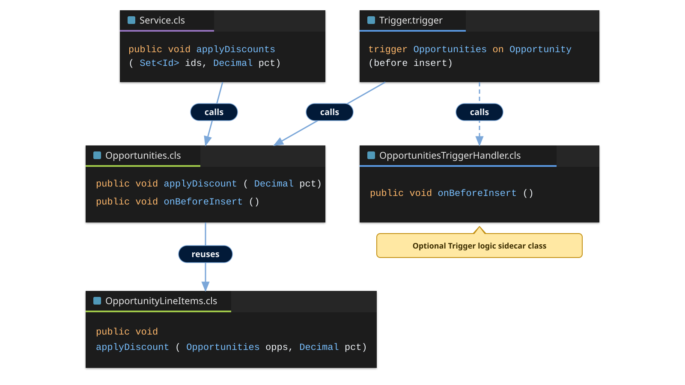

<!--
Service and Trigger both call Opportunities (solid). The dotted line to OpportunitiesTriggerHandler is the optional trigger-logic sidecar. onBeforeInsert can live on the Domain or the handler. Domain reuses OpportunityLineItems for line discounts.
-->

---

<!-- _class: detail-slide checklist-slide -->

# Pattern Checklist


<ul class="checklist">
<li>Pattern Checklist</li>
<li>Separation of Concerns<span class="check">✅</span></li>
<li>Service Layer<span class="check">✅</span></li>
<li>Domain Layer<span class="check">✅</span></li>
<li>Selector Layer<span class="check"></span></li>
</ul>

<!--
Domain ticked. Selector is the last pattern checkbox for this session.
-->

---

<!-- _class: detail-slide -->

# Selector ➡️ SOQL is Logic

* A Selector class encapsulates **query complexity** and supports **reuse**
* **Discovery** — required query easy to discover with named methods, `readyToInvoiceAsQueryLocator`, `selectRecentlyUsed`
* **Consistency** — apply same fields, ordering unless overridden
  * Start with common fields, add as needed
* Typically **class per object** — `OpportunitiesSelector`, `AccountsSelector`
* Consider **class per group of queries** — `WarehouseHandlingSelector`
* **Reuse** across Service, Domain, handlers, and sometimes controllers

<!--
Explain pain in large orgs before method naming and security slides. Named methods make the right query discoverable — readyToInvoiceAsQueryLocator, not a scavenger hunt through SOQL. Consistency is the same fields and order unless a method overrides them — start with the common field list, then add related fields only when a method needs them. Default is one selector per object; a feature-shaped selector is also valid when queries belong together.
-->

---

<!-- _class: detail-slide promises-slide -->

# Selector ☑️ Checklist

* Provide result ordering, and field consistency by default
* Name **what** is returned and **how** it is filtered
  * `selectByIdWithProducts`, `selectByOpportunity`, `readyToInvoiceAsQueryLocator`
* Methods can also **dereference relationships** for callers — e.g. `accountsSelector.selectByOpportunity(opportunities)`
* Elevation to system only when required, with overload, e.g.
  * `selectById(Set<Id> ids)`
  * `selectById(Set<Id> ids, Boolean systemMode)`
* Consider flattened data types to simplify consumption e.g. `List<OpportunitySummary> selectOpportunitySummary(Set<Id> idSet)`
* Selectors run in user mode by default

<!--
Method names are documentation. New developer knows which query to call for discount vs invoicing vs batch start. Default field list and ORDER BY keep results consistent unless a method overrides them. A selector can also walk the relationship for the caller — AccountsSelector.selectByOpportunity takes Opportunities and returns the related Accounts. Flattened DTOs like OpportunitySummary hide related-object navigation from callers. Selectors stay user mode via inherited sharing; elevate only through the systemMode overload.
-->

---

<!-- _class: detail-slide code-slide duo-slide selector-examples-slide -->

# Selector - Code Example

<div class="duo">
<div class="duo-col">
<div class="vscode">
<div class="vscode-tabs"><span class="vscode-tab vscode-tab-selector">OpportunitiesSelector.selectById</span></div>

```apex
public List<Opportunity> selectById(Set<Id> idSet) {
  return [
    SELECT Id, AccountId, Amount, CloseDate, Description,
           DiscountType__c, Name, StageName, InvoicedStatus__c
    FROM Opportunity
    WHERE Id IN :idSet
    ORDER BY Name
  ];
}
```

</div>
</div>
<div class="duo-col">
<div class="vscode">
<div class="vscode-tabs"><span class="vscode-tab vscode-tab-selector">OpportunitiesSelector.readyToInvoiceAsQueryLocator</span></div>

```apex
public Database.QueryLocator readyToInvoiceAsQueryLocator() {
  return Database.getQueryLocator([
    SELECT Id, AccountId, Amount, CloseDate, Description,
           DiscountType__c, Name, StageName, InvoicedStatus__c
    FROM Opportunity
    WHERE InvoicedStatus__c = 'Ready'
    ORDER BY Name
  ]);
}
```

</div>
</div>
<div class="duo-col duo-col-span">
<div class="vscode">
<div class="vscode-tabs"><span class="vscode-tab vscode-tab-selector">OpportunitiesSelector.selectOpportunitySummary</span></div>

```apex
public List<OpportunitySummary> selectOpportunitySummary(Set<Id> idSet) {
  List<OpportunitySummary> summaries = new List<OpportunitySummary>();
  for (Opportunity opportunity : [
    SELECT Id, AccountId, Amount, CloseDate, Description,
           DiscountType__c, Name, StageName, InvoicedStatus__c,
           Account.Name, Account.AccountNumber, Account.Owner.Name
    FROM Opportunity
    WHERE Id IN :idSet
    ORDER BY Name
  ]) {
    summaries.add(new OpportunitySummary(opportunity));
  }
  return summaries;
}
```

</div>
<p class="selector-tip"><span class="info-mark">ⓘ</span> These examples are absent any kind of SOQL querying library which can help manage consistency between methods, such as common fields and sorting. The <code>fflib_SObjectSelector</code> base class provides support for this.</p>
</div>
</div>

<!--
Top two query Opportunity fields only. Bottom adds Account fields and wraps each row in OpportunitySummary so callers get a flattened view. All three ORDER BY Name so callers see the same sequence. Tip: this session writes SOQL by hand; fflib_SObjectSelector later centralizes shared fields and sort.
-->

---

<!-- _class: detail-slide diagram-slide selector-consumers-slide -->

# Selector - Consumers and Dependencies

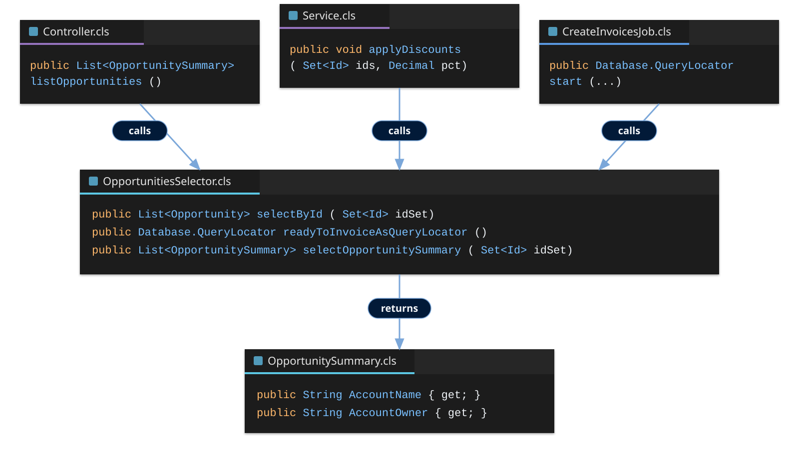

<!--
Service, Domain, Controller, and CreateInvoicesJob all call OpportunitiesSelector — pattern consumers first, then other callers. applyDiscounts loads by Id; Domain reuses the same selector when it needs records. listOpportunities is a UI-shaped read that uses selectOpportunitySummary. The batch start method uses readyToInvoiceAsQueryLocator. OpportunitySummary is the flattened DTO.
-->

---

<!-- _class: detail-slide checklist-slide -->

# Pattern Checklist


<ul class="checklist">
<li>Pattern Checklist</li>
<li>Separation of Concerns<span class="check">✅</span></li>
<li>Service Layer<span class="check">✅</span></li>
<li>Domain Layer<span class="check">✅</span></li>
<li>Selector Layer<span class="check">✅</span></li>
</ul>

<!--
All four boxes ticked — SoC, Service, Domain, and Selector. Close the pattern loop before wrap-up.
-->

---

<!-- _class: detail-slide diagram-slide -->

# Coming soon - FFLib Docs

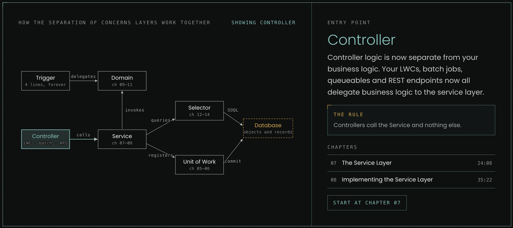

<!--
Preview of the upcoming fflib docs. Guide, videos, and pattern reference in one place — coming soon.
-->

---

<!-- _class: detail-slide series-slide -->

# What's next in the series

<table>
<thead>
<tr><th></th><th>Session</th></tr>
</thead>
<tbody>
<tr class="done"><td><span class="check">✅</span></td><td>Session #1 - Separation of Concerns in Apex: Why Your Future Self Will Thank You</td></tr>
<tr><td><span class="check"></span></td><td>Session #2 - Service Layers Explained: Coordinating Business Logic in Apex</td></tr>
<tr><td><span class="check"></span></td><td>Session #3 - Domain vs Service: Where Should Your Apex Logic Live?</td></tr>
<tr><td><span class="check"></span></td><td>Session #4 - Query Logic as a First-Class Architecture Concern</td></tr>
<tr><td><span class="check"></span></td><td>Session #5 - Mocking in Apex: Why It Changes Everything</td></tr>
<tr><td><span class="check"></span></td><td>Session #6 - Enterprise-Scale Apex Across Multiple Packages</td></tr>
</tbody>
</table>

<!--
Session 1 is done. Walk the remaining five as the series roadmap — Service, Domain vs Service, Selector/query architecture, mocking, then multi-package scale.
-->

---

<!-- _class: title-slide -->

# Thank you!

#### Andrew Fawcett · Code With Sally
### FFLib Series · Session 001


<!--
Questions. Remind audience of repo paths and scratch org aliases.
-->

