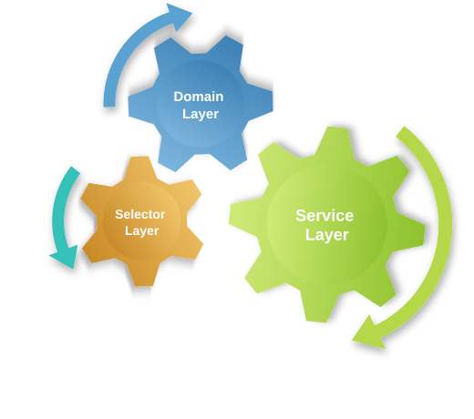
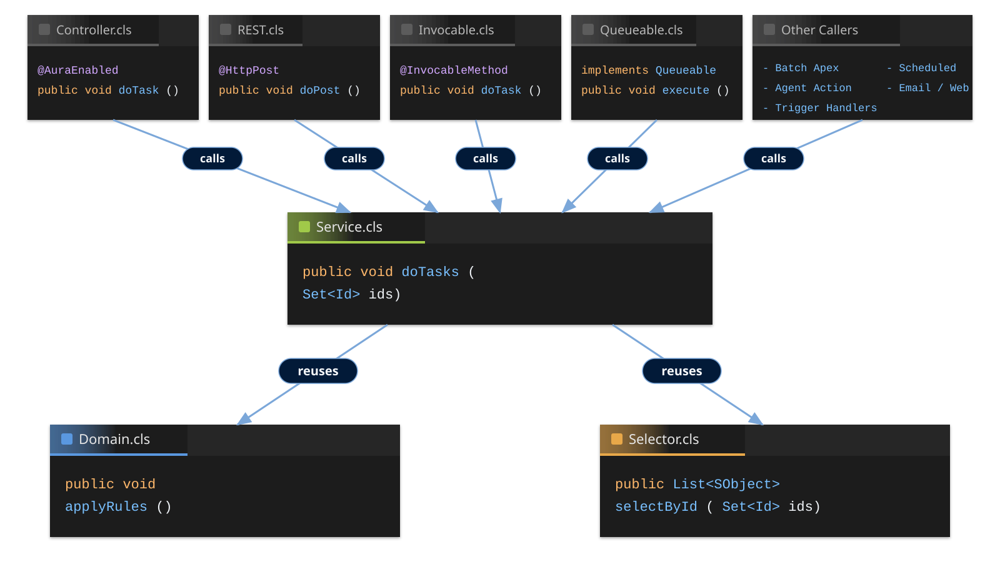
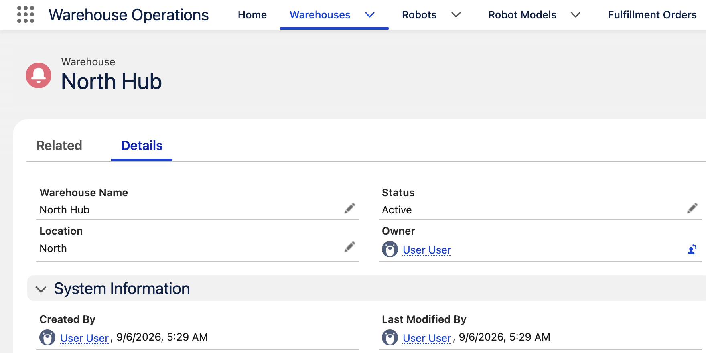
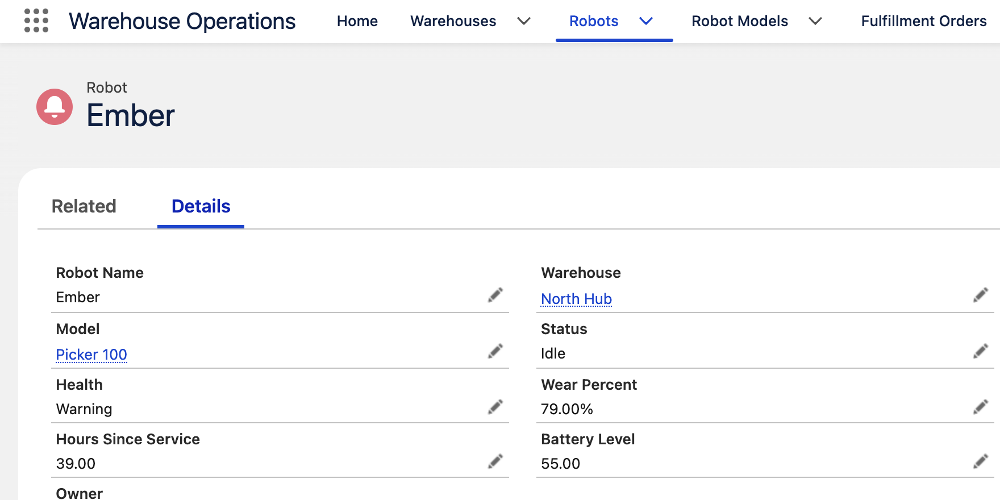
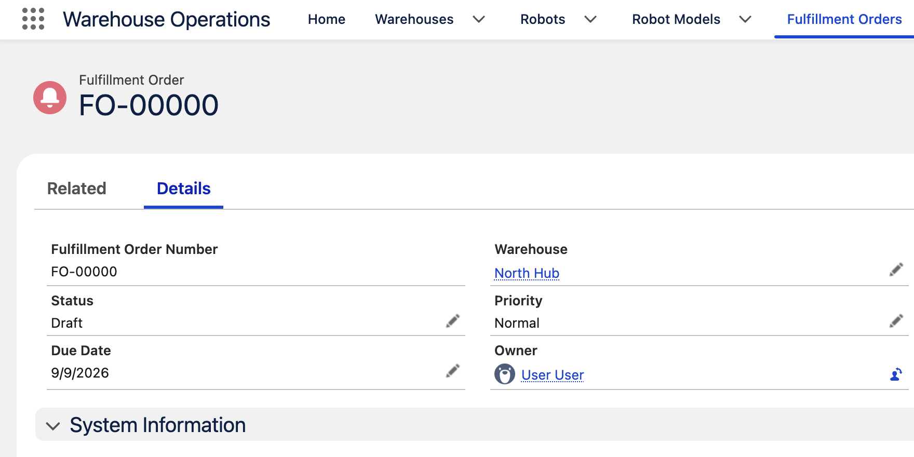
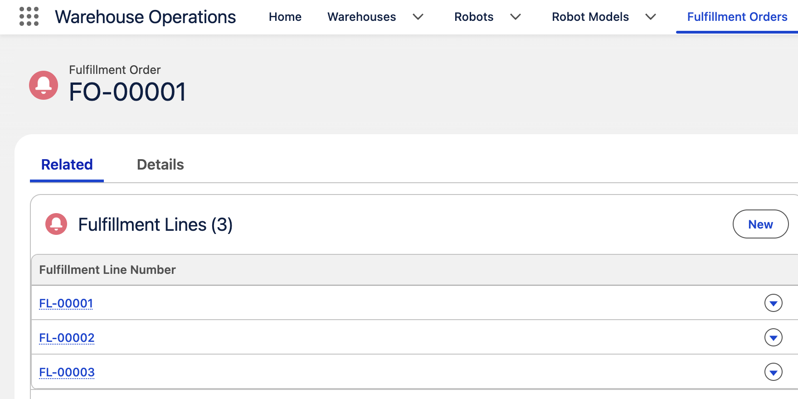
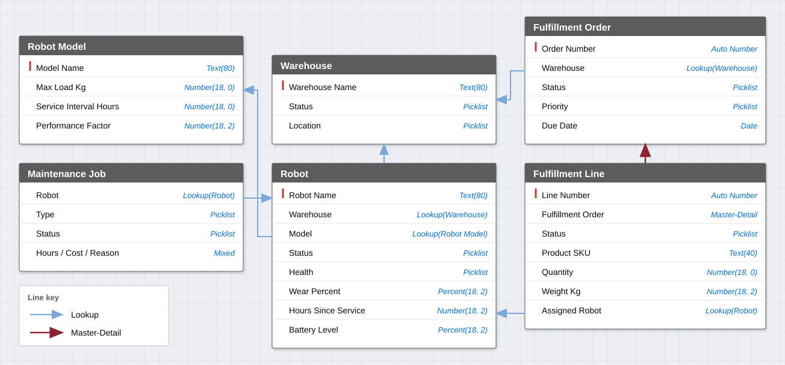
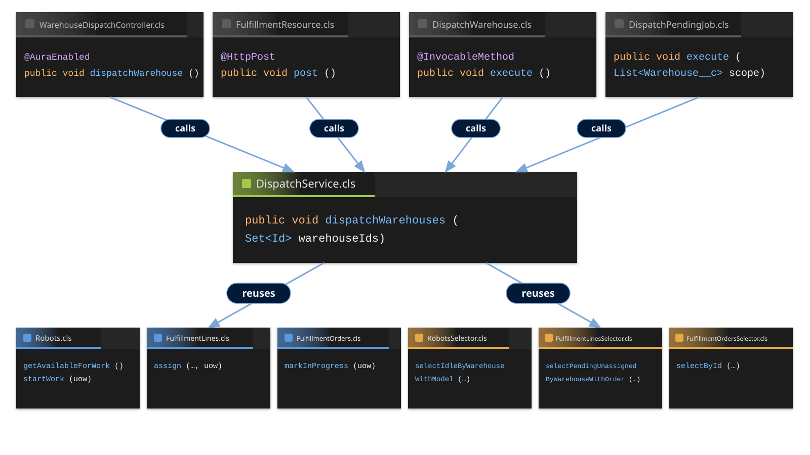
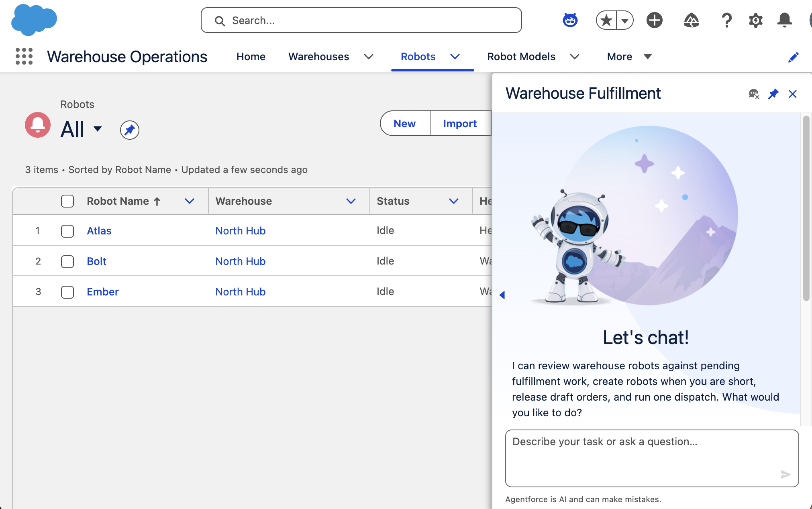
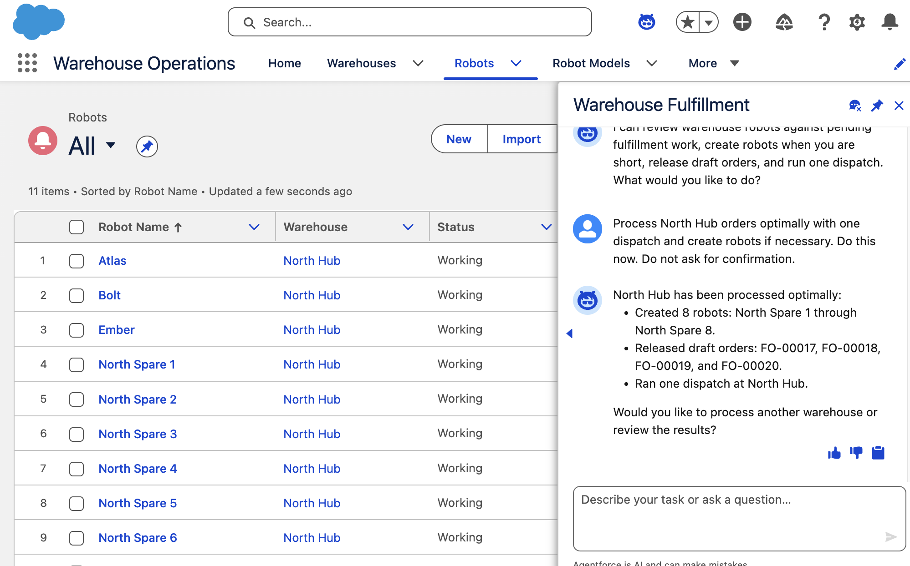

<!-- _class: title-slide -->

# Service Layers Explained
### Coordinating Business Logic in Apex
#### FFLib Series · Session 002

#### Andrew Fawcett
###### Code With Sally


<!--
Session 001 put SoC on the table. Tonight the Service is the conductor — and the Unit of Work is how it commits. Warehouse Operations is the desk we will walk, then demo.
-->

---

<!-- _class: detail-slide about-slide -->

<div class="about-split">
<div class="about-copy">

# About me

##### Independent Salesforce Consultant | Former CPO, Salesforce, Heroku | CTO, FinancialForce.com

* **Independent consultant and architect** — Salesforce platform development, PaaS integrations, and agentic AI
* **Open source and guidance** — creator of DLRS, Apex frameworks, and *Salesforce Platform Enterprise Architecture*
* **Salesforce Customers and Partners Advisory** — architecture and scale, AI-enhanced workflows, org health and codebase mentoring, and ISV product advisory

<!-- -->

* Reduce complexity, unblock engineering, and leave architectures — and teams — able to evolve.

</div>
<div class="about-aside">
<div class="about-logo-wrap">

</div>
<a class="about-book" href="https://www.amazon.com/Salesforce-Platform-Enterprise-Architecture-applications/dp/1804619779">

</a>
</div>
</div>

<!--
Andrew Fawcett — AndyInTheCloud. Same intro as Session 001.
-->

---

<!-- _class: detail-slide series-slide -->

# The series

<table>
<thead>
<tr><th></th><th>Session</th></tr>
</thead>
<tbody>
<tr class="done"><td><span class="check">✅</span></td><td>Session #1 - Separation of Concerns in Apex: Why Your Future Self Will Thank You</td></tr>
<tr class="current"><td><span class="check"></span></td><td>Session #2 - Service Layers Explained: Coordinating Business Logic in Apex</td></tr>
<tr><td><span class="check"></span></td><td>Session #3 - Domain vs Service: Where Should Your Apex Logic Live?</td></tr>
<tr><td><span class="check"></span></td><td>Session #4 - Query Logic as a First-Class Architecture Concern</td></tr>
<tr><td><span class="check"></span></td><td>Session #5 - Mocking in Apex: Why It Changes Everything</td></tr>
<tr><td><span class="check"></span></td><td>Session #6 - Enterprise-Scale Apex Across Multiple Packages</td></tr>
</tbody>
</table>

<!--
Session 1 is done. This session is Service + Unit of Work, using a warehouse operations sample so Service and Domain no longer share a noun.
-->

---

<!-- _class: detail-slide service-layer-def-slide -->

# Coordinating Business Logic in Apex

<div class="service-layer-graphic">
  
</div>

<!--
Clients stay behind the Warehouse Operations App Services — LWC, REST, Flow, Agent, Batch, and more. In front are the three warehouse services: Fulfillment, Dispatch, Maintenance. Do not say orchestrator. The Service layer is the conductor; the named services are the features.
-->

---

<!-- _class: detail-slide quote-slide service-quote-slide -->

# Service Layer

<blockquote>
Defines an application's boundary with a layer of services that establishes a set of available operations and coordinates the application's response in each operation.
</blockquote>

<p class="quote-source"><a href="https://martinfowler.com/eaaCatalog/serviceLayer.html">Martin Fowler</a> — <em>Patterns of Enterprise Application Architecture</em></p>

<div class="service-layer-band">
  
</div>

<!--
Fowler. The Service Layer is the application's boundary — a set of operations, and the coordination of the response in each one. Same three warehouse services as the last slide: Fulfillment, Dispatch, Maintenance.
-->

---

<!-- _class: detail-slide checklist-slide -->

# Service Layers Explained



<ul class="checklist">
<li>Service Layers Explained</li>
<li class="current">Separation of Concerns Recap<span class="check"></span></li>
<li>The Unit of Work<span class="check"></span></li>
<li>Service Layer Principles<span class="check"></span></li>
<li>Warehouse Operations App Overview<span class="check"></span></li>
<li>Warehouse Operations App Code<span class="check"></span></li>
<li>Warehouse Operations Agent<span class="check"></span></li>
</ul>

<!--
Tonight's path. Recap first — then Unit of Work, principles, the warehouse desk, the code, then the agent.
-->

---

<!-- _class: detail-slide diagram-slide layers-diagram-slide -->

# Salesforce Platform Layers


<!--
Recap from 001. Every layer has declarative and coding paths. SoC is putting each concern in the right layer.
-->

---

<!-- _class: detail-slide diagram-slide color-key-slide -->

# Apex Enterprise Patterns (fflib) - Color Chart

<div class="color-key-split">
<div class="color-key-cogs">

</div>
<div class="color-key-legends">
<div class="color-key-legend-stack">
<div class="color-key-legend"><span class="swatch swatch-client"></span>Client</div>
<div class="color-key-legend"><span class="swatch swatch-service"></span>Service</div>
<div class="color-key-legend"><span class="swatch swatch-domain"></span>Domain</div>
<div class="color-key-legend"><span class="swatch swatch-trigger"></span>Trigger Handler</div>
<div class="color-key-legend"><span class="swatch swatch-selector"></span>Selector</div>
</div>
</div>
</div>

<!--
Grey is a Client. Green is Service — named for the process. Blue is Domain — named for the object. Darker blue is a Trigger Handler — next to Domain because it is record work. Orange is Selector. The stacked key is on this slide; the small strip returns on the class tabs later.
-->

---

<!-- _class: detail-slide diagram-slide layers-diagram-slide layers-classes-slide -->

# Suggested Class Folder Layout

<div class="soc-layers">
<div class="soc-layer soc-layer-presentation">
<div class="soc-layer-header">Presentation</div>
<div class="vscode">
<div class="vscode-tabs"><span class="vscode-tab vscode-tab-client">FulfillmentReleaseController.cls</span><span class="vscode-tab vscode-tab-alt vscode-tab-client">WarehouseDispatchController.cls</span><span class="vscode-tab vscode-tab-alt vscode-tab-client">MaintenanceCompleteController.cls</span><span class="vscode-tab vscode-tab-alt vscode-tab-more">…</span></div>
<div class="vscode-pane"><span class="vscode-comment">// /classes/controllers</span></div>
</div>
</div>
<div class="soc-layer soc-layer-integration">
<div class="soc-layer-header">Integration</div>
<div class="vscode">
<div class="vscode-tabs"><span class="vscode-tab vscode-tab-client">ReleaseOrders.cls</span><span class="vscode-tab vscode-tab-alt vscode-tab-client">DispatchWarehouse.cls</span><span class="vscode-tab vscode-tab-alt vscode-tab-client">FulfillmentResource.cls</span></div>
<div class="vscode-pane"><span class="vscode-comment">// /classes/actions · /classes/restapis</span></div>
</div>
</div>
<div class="soc-layer soc-layer-business">
<span class="soc-layer-heart">❤️</span>
<div class="soc-layer-header">Business Logic</div>
<div class="soc-layer-windows">
<div class="vscode">
<div class="vscode-tabs"><span class="vscode-tab vscode-tab-service">FulfillmentService.cls</span><span class="vscode-tab vscode-tab-alt vscode-tab-service">DispatchService.cls</span><span class="vscode-tab vscode-tab-alt vscode-tab-service">MaintenanceService.cls</span></div>
<div class="vscode-pane"><span class="vscode-comment">// /classes/services — named for the process</span></div>
</div>
<div class="vscode">
<div class="vscode-tabs"><span class="vscode-tab vscode-tab-domain">Robots.cls</span><span class="vscode-tab vscode-tab-alt vscode-tab-domain">FulfillmentOrders.cls</span><span class="vscode-tab vscode-tab-alt vscode-tab-domain">FulfillmentLines.cls</span><span class="vscode-tab vscode-tab-alt vscode-tab-more">…</span></div>
<div class="vscode-pane"><span class="vscode-comment">// /classes/domains — named for the object</span></div>
</div>
</div>
</div>
<div class="soc-layer soc-layer-data">
<div class="soc-layer-header">Data Access</div>
<div class="vscode">
<div class="vscode-tabs"><span class="vscode-tab vscode-tab-selector">RobotsSelector.cls</span><span class="vscode-tab vscode-tab-alt vscode-tab-selector">FulfillmentLinesSelector.cls</span><span class="vscode-tab vscode-tab-alt vscode-tab-selector">WarehousesSelector.cls</span></div>
<div class="vscode-pane"><span class="vscode-comment">// /classes/selectors</span></div>
</div>
</div>
<div class="soc-layer soc-layer-database">
<div class="soc-layer-header">Database</div>
<div class="vscode">
<div class="vscode-tabs"><span class="vscode-tab vscode-tab-handler">RobotsTriggerHandler.cls</span></div>
<div class="vscode-pane"><span class="vscode-comment">// /classes/triggerHandlers</span></div>
</div>
</div>
</div>

<!--
Same five platform layers as 001 — warehouse class names. The colors you just saw. Service names a process. Domain names an object. That is why this sample exists.
-->

---

<!-- _class: detail-slide diagram-slide -->

# Who can call whom


<!--
Same matrix as the table. Clients call Service and Selector — not Domain. Trigger handlers may call Service, Domain, or Selector. Service may call Service, Domain, and Selector — and when it calls Service, it passes the outer Unit of Work. Domain may call Domain and Selector; it is given a UoW, it does not create one. Selector may compose with Selector — it does not call Service or Domain.
-->

---

<!-- _class: detail-slide callers-table-slide -->

# Who can call whom

<table>
<thead>
<tr><th>Caller</th><th><span class="layer-pill layer-pill-service">Service</span></th><th><span class="layer-pill layer-pill-domain">Domain</span></th><th><span class="layer-pill layer-pill-selector">Selector</span></th></tr>
</thead>
<tbody>
<tr><td><span class="layer-pill layer-pill-client">Client</span> (LWC, REST, Flow, Agent, Batch, ...)</td><td>●</td><td></td><td>●</td></tr>
<tr><td><span class="layer-pill layer-pill-handler">Trigger Handler</span></td><td>●</td><td>●</td><td>●</td></tr>
<tr><td><span class="layer-pill layer-pill-service">Service</span></td><td>●</td><td>●</td><td>●</td></tr>
<tr><td><span class="layer-pill layer-pill-domain">Domain</span></td><td></td><td>●</td><td>●</td></tr>
<tr><td><span class="layer-pill layer-pill-selector">Selector</span></td><td></td><td></td><td>●</td></tr>
</tbody>
</table>

<!--
Same matrix as the graphic. Clients call Service and Selector, not Domain. Trigger handlers may call Service, Domain, or Selector. Domain may call Domain and Selector. Service may call Service — and when it does, it passes the outer Unit of Work. Selector may compose with Selector — it does not call Service or Domain.
-->

---

<!-- _class: detail-slide diagram-slide evolve-slide -->

# How durable is your code when change occurs?

<p class="evolve-subtext">How users interact with your application changes a lot — protect against it with SoC</p>

<div class="evolve-layout">
<div class="evolve-spacer" aria-hidden="true"></div>
<div class="evolve-stack">
<div class="timeline timeline-impact">
<div class="timeline-row">
<span class="t-node">VF</span>
<span class="t-bridge"><span class="t-line"></span><span class="t-icon">🤔</span></span>
<span class="t-node">Aura</span>
<span class="t-bridge"><span class="t-line"></span><span class="t-icon">🤔</span></span>
<span class="t-node">LWC</span>
<span class="t-bridge"><span class="t-line"></span><span class="t-icon">🤔</span></span>
<span class="t-node">Agent Action</span>
<span class="t-bridge"><span class="t-line"></span><span class="t-icon">🤔</span></span>
<span class="t-node">React</span>
<span class="t-bridge"><span class="t-line"></span><span class="t-icon">🤔</span></span>
<span class="t-next-anchor"><span class="t-node t-node-next">Next?</span><span class="evolve-callout"><span class="evolve-caret" aria-hidden="true"></span><span class="info-mark">ⓘ</span><strong>Claudeforce.</strong> Salesforce + Anthropic, August 2026 — yet another interaction layer on your application.</span></span>
</div>
<p class="timeline-legend">🤔 Business Logic Impact</p>
</div>
<div class="vscode evolve-copy">
<div class="vscode-tabs"><span class="vscode-tab vscode-tab-client">WarehouseDispatchController.cls</span><span class="vscode-tab vscode-tab-alt vscode-tab-client">DispatchWarehouse.cls</span><span class="vscode-tab vscode-tab-alt vscode-tab-client">FulfillmentReleaseController.cls</span><span class="vscode-tab vscode-tab-alt vscode-tab-client">ReleaseOrders.cls</span></div>
<pre><code>// logic copied — every new client type
VF · Aura · LWC · Agent Action · React · Next?
  └─► WarehouseDispatchController.dispatchWarehouse(...)
  └─► DispatchWarehouse.execute(...)
  └─► FulfillmentReleaseController.releaseOrder(...)
  └─► ReleaseOrders.execute(...)</code></pre>
</div>
<div class="timeline timeline-service">
<div class="timeline-row">
<span class="t-node">VF</span>
<span class="t-bridge t-bridge-heart"><span class="t-line"></span><span class="t-icon">❤️</span></span>
<span class="t-node">Aura</span>
<span class="t-bridge t-bridge-heart"><span class="t-line"></span><span class="t-icon">❤️</span></span>
<span class="t-node">LWC</span>
<span class="t-bridge t-bridge-heart"><span class="t-line"></span><span class="t-icon">❤️</span></span>
<span class="t-node">Agent Action</span>
<span class="t-bridge t-bridge-heart"><span class="t-line"></span><span class="t-icon">❤️</span></span>
<span class="t-node">React</span>
<span class="t-bridge t-bridge-heart"><span class="t-line"></span><span class="t-icon">❤️</span></span>
<span class="t-node">Next?</span>
</div>
</div>
<div class="vscode evolve-services">
<div class="vscode-tabs"><span class="vscode-tab vscode-tab-service">DispatchService.cls</span><span class="vscode-tab vscode-tab-alt vscode-tab-service">FulfillmentService.cls</span></div>
<pre><code>// same services — every client type
LWC · REST · Batch · Flow · Agent Action · Next?
  └─► DispatchService.dispatchWarehouses(...)
  └─► FulfillmentService.releaseOrders(...)</code></pre>
</div>
</div>
<div class="evolve-footer">
<p class="evolve-tagline">❤️ Your business logic is <strong>the</strong> most important logic in your app — and when it's everywhere, it becomes a <strong>significant investment risk</strong></p>
</div>
</div>

<!--
Recap from 001, warehouse names. Top timeline: each new client copied dispatch and release. Point at Next? — Claudeforce, August 2026, Salesforce + Anthropic. Claude talking to your org is another interaction layer, not a new place to put the rules. Bottom timeline: DispatchService and FulfillmentService — hearts not warnings. Tonight we stay on the Service that makes the bottom row true.
-->

---

<!-- _class: detail-slide checklist-slide -->

# Service Layers Explained


<ul class="checklist">
<li>Service Layers Explained</li>
<li>Separation of Concerns Recap<span class="check">✅</span></li>
<li class="current">The Unit of Work<span class="check"></span></li>
<li>Service Layer Principles<span class="check"></span></li>
<li>Warehouse Operations App Overview<span class="check"></span></li>
<li>Warehouse Operations App Code<span class="check"></span></li>
<li>Warehouse Operations Agent<span class="check"></span></li>
</ul>

<!--
Recap is done. Unit of Work next — the pattern, then Fowler, then the Opportunity samples from the blog.
-->

---

<!-- _class: detail-slide -->

# Unit of Work

* [Martin Fowler](https://martinfowler.com/eaaCatalog/unitOfWork.html) — *Patterns of Enterprise Application Architecture*
  * *“Maintains a list of objects affected by a business transaction and coordinates the writing out of changes and the resolution of concurrency problems.”*
* One transaction: work completes or is rolled back explicitly
* Best practices: automatically bulkifies, runs in user mode
* Relationships: built in memory without having to insert parent
* `commitWork()` takes a savepoint and rolls back if anything fails
* In Apex that means: register work now, `commitWork()` once — see [AndyInTheCloud, June 2013](https://andyinthecloud.com/2013/06/09/managing-your-dml-and-transactions-with-a-unit-of-work/)

<!--
Fowler first. Then the Apex reasons: governors (150 DML), parent-then-child insert order, and savepoint discipline when you catch exceptions.
-->

---

<!-- _class: detail-slide code-slide dense-code-slide -->

# Without Unit Of Work — Lines: 73

<div class="dense-code-split">
<div class="vscode dense-code-full">
<div class="vscode-tabs"><span class="vscode-tab vscode-tab-service">Opportunity setup — raw DML</span></div>

```apex lines=1,2,3,4,5,7,8,11,12,13,14,15,17,18,19,20,21,25,26,27,29,30,31,32,33,34,36,38,39,41,42,43,45,46,47,49,50,51,53,54,55,56,57,59,60,61,63,64,65,67,68,69,70,71,72,73
List<Opportunity> opps = new List<Opportunity>();
List<List<Product2>> productsByOpp = new List<List<Product2>>();
List<List<PricebookEntry>> pbesByOpp = new List<List<PricebookEntry>>();
List<List<OpportunityLineItem>> linesByOpp = new List<List<OpportunityLineItem>>();
for (Integer o = 0; o < 10; o++) {
  Opportunity opp = new Opportunity();
  // ... set Name, StageName, CloseDate
  opps.add(opp);
  List<Product2> products = new List<Product2>();
  List<PricebookEntry> pbes = new List<PricebookEntry>();
  List<OpportunityLineItem> lines = new List<OpportunityLineItem>();
  for (Integer i = 0; i < o + 1; i++) {
    Product2 product = new Product2();
    // ... set Name
    products.add(product);
    PricebookEntry pbe = new PricebookEntry();
    // ... set UnitPrice, IsActive, Pricebook2Id
    pbes.add(pbe);
    OpportunityLineItem oli = new OpportunityLineItem();
    // ... set Quantity, TotalPrice
    lines.add(oli);
  }
  productsByOpp.add(products);
  pbesByOpp.add(pbes);
  linesByOpp.add(lines);
}
insert opps;
List<Product2> allProducts = new List<Product2>();
for (List<Product2> products : productsByOpp) {
  allProducts.addAll(products);
}
insert allProducts;
Integer oppIdx = 0;
List<PricebookEntry> allPbes = new List<PricebookEntry>();
for (List<PricebookEntry> pbes : pbesByOpp) {
  List<Product2> products = productsByOpp[oppIdx++];
  Integer lineIdx = 0;
  for (PricebookEntry pbe : pbes) {
    pbe.Product2Id = products[lineIdx++].Id;
  }
  allPbes.addAll(pbes);
}
insert allPbes;
oppIdx = 0;
List<OpportunityLineItem> allLines = new List<OpportunityLineItem>();
for (List<OpportunityLineItem> lines : linesByOpp) {
  List<PricebookEntry> pbes = pbesByOpp[oppIdx];
  Integer lineIdx = 0;
  for (OpportunityLineItem oli : lines) {
    oli.OpportunityId = opps[oppIdx].Id;
    oli.PricebookEntryId = pbes[lineIdx++].Id;
  }
  allLines.addAll(lines);
  oppIdx++;
}
insert allLines;
```

</div>
<div class="dense-code-zooms">
<div class="vscode dense-code-zoom dense-code-zoom-lists">
<div class="vscode-tabs"><span class="vscode-tab vscode-tab-service">Zoom · lines 1–4</span></div>

```apex
List<Opportunity> opps = new List<Opportunity>();
List<List<Product2>> productsByOpp = new List<List<Product2>>();
List<List<PricebookEntry>> pbesByOpp = new List<List<PricebookEntry>>();
List<List<OpportunityLineItem>> linesByOpp = new List<List<OpportunityLineItem>>();
```

</div>
<div class="vscode dense-code-zoom dense-code-zoom-stitch">
<div class="vscode-tabs"><span class="vscode-tab vscode-tab-service">Zoom · lines 47–56</span></div>

```apex lines=47,49,50,51,53,54,55,56
for (List<PricebookEntry> pbes : pbesByOpp) {
  List<Product2> products = productsByOpp[oppIdx++];
  Integer lineIdx = 0;
  for (PricebookEntry pbe : pbes) {
    pbe.Product2Id = products[lineIdx++].Id;
  }
  allPbes.addAll(pbes);
}
```

</div>
<div class="vscode dense-code-zoom dense-code-zoom-dml">
<div class="vscode-tabs"><span class="vscode-tab vscode-tab-service">Zoom · lines 36, 43, 57, 73</span></div>

```apex lines=36,43,57,73
insert opps;
insert allProducts;
insert allPbes;
insert allLines;
```

</div>
<div class="vscode dense-code-zoom dense-code-zoom-txn">
<div class="vscode-tabs"><span class="vscode-tab vscode-tab-service">Zoom · Transaction control</span></div>

```apex
Savepoint sp = Database.setSavepoint();
try {
  // ... lists, stitch, four inserts
} catch (Exception e) {
  Database.rollback(sp);
  throw new DispatchServiceException(e.getMessage(), e);
}
```

</div>
</div>
</div>

<!--
From AndyInTheCloud 2013. Four inserts, maps and indexes to stay bulkified, you own the dependency order. The left sample has no savepoint — same hole as 001. Catch after insert opps and Apex still commits what succeeded: an Opportunity with no lines. The wrap is the applyDiscounts template from last week.
-->

---

<!-- _class: detail-slide code-slide compact-code-slide uow-interact-slide -->

# With Unit of Work — Lines: 31 (58% ↓)

<div class="vscode">
<div class="vscode-tabs"><span class="vscode-tab vscode-tab-service">Same work — register, then commit</span></div>

```apex lines=1,2,3,4,5,6,7,8,9,10,13,14,15,16,17,18,19,23,24,25,27,28,29,30,31
fflib_SObjectUnitOfWork uow = new fflib_SObjectUnitOfWork(
  new List<Schema.SObjectType> {
    Product2.SObjectType,
    PricebookEntry.SObjectType,
    Opportunity.SObjectType,
    OpportunityLineItem.SObjectType
  });
for (Integer o = 0; o < 10; o++) {
  Opportunity opp = new Opportunity();
  // ... set Name, StageName, CloseDate
  uow.registerNew(opp);
  for (Integer i = 0; i < o + 1; i++) {
    Product2 product = new Product2();
    product.Name = opp.Name + ' : Product : ' + i;
    uow.registerNew(product);
    PricebookEntry pbe = new PricebookEntry();
    // ... set UnitPrice, IsActive, Pricebook2Id
    uow.registerNew(pbe, PricebookEntry.Product2Id, product);
    OpportunityLineItem oli = new OpportunityLineItem();
    // ... set Quantity, TotalPrice
    uow.registerRelationship(oli, OpportunityLineItem.PricebookEntryId, pbe);
    uow.registerNew(oli, OpportunityLineItem.OpportunityId, opp);
  }
}
uow.commitWork();
```

</div>

<!--
Same blog post. No maps. registerNew / registerRelationship see into the future — the UoW inserts in type order and fills Ids. The type list is dependency order — Product2 and Opportunity before the children that need their Ids. commitWork owns the savepoint.
-->

---

<!-- _class: detail-slide -->

# fflib_SObjectUnitOfWork Methods

* `fflib_SObjectUnitOfWork(List<SObjectType> types)` — dependency order
* `registerNew(record)` · `registerNew(record, field, parent)`
* `registerRelationship(record, field, related)` — stitch before Ids exist
* `registerDirty(record)` · `registerDeleted(record)`
* `commitWork()` — savepoint, bulk DML, rollback, rethrow
* Other methods: `registerWork`, `registerUpsert`, `registerEmail` …

<!--
This is the library class. The warehouse sample wraps it. We will open that wrapper when we walk the app — not yet.
-->

---

<!-- _class: detail-slide checklist-slide -->

# Service Layers Explained


<ul class="checklist">
<li>Service Layers Explained</li>
<li>Separation of Concerns Recap<span class="check">✅</span></li>
<li>The Unit of Work<span class="check">✅</span></li>
<li class="current">Service Layer Principles<span class="check"></span></li>
<li>Warehouse Operations App Overview<span class="check"></span></li>
<li>Warehouse Operations App Code<span class="check"></span></li>
<li>Warehouse Operations Agent<span class="check"></span></li>
</ul>

<!--
Pattern is on the table. Service Layer Principles next — conductor, consumers, checklist, Unit of Work in the service. Then the warehouse desk.
-->

---

<!-- _class: detail-slide service-conductor-slide -->

# Service ➡️ Task Orientated Logic

* A Service represents a **feature** of the application
  * Fulfillment — `FulfillmentService.cls`
  * Dispatch — `DispatchService.cls`
  * Maintenance — `MaintenanceService.cls`
* Each method is a **task** within that feature — `releaseOrders`, `dispatchWarehouses`, `completeLines`
* Think of it as the **conductor** — the band handles querying and object-specific logic; the Service sets the tempo and the rules of the orchestration

<div class="conductor-graphic">
  
  <p class="conductor-caption"><span>Tasks in front</span><span>Service — the conductor</span><span>The band — querying and object-specific logic</span></p>
</div>

<!--
Same 001 slide, new names. There is no RobotsService. Dispatch is not a Robot method.
-->

---

<!-- _class: detail-slide diagram-slide -->

# Services have many Consumers


<!--
Same hub as 001. Warehouse LWC, FulfillmentResource, invocables, batch, and Agentforce should call DispatchService — not each copy the match rules.
-->

---

<!-- _class: detail-slide promises-slide -->

# Service ☑️ Checklist

* Client-agnostic inputs and outputs
  * ✅ `dispatchWarehouses(Set<Id> warehouseIds)`
  * ❌ `dispatch(DispatchForm form)`
* Client-agnostic exceptions
  * ✅ `throw DispatchServiceException`
  * ❌ `throw AuraHandledException`
* **Bulkification** — collections in and out; don't force callers to loop
  * ✅ `dispatchWarehouses(Set<Id> warehouseIds)`
  * ❌ `dispatchWarehouse(Id warehouseId)` only
* **Transactions** — one UOW; rollback; Service→Service passes the outer uow
* **Security** — enforce user-mode in DML (UOW) and SOQL (Selector)

<!--
Same promises as 001. Transaction bullet now names Unit of Work instead of a raw savepoint. AuraHandledException still belongs in the controller.
-->

---

<!-- _class: detail-slide promises-slide -->

# Service 🔁 Evolution

* **Services** — now prefer instance methods over static
  * ✅ `DispatchService.newInstance().dispatchWarehouses(...)`
  * ❌ `public static void dispatchWarehouses(...)`
* **Apex interfaces** — now recommended only for dependency injection
  * ✅ `IDispatchService` only when a test or package must inject
  * ❌ `IFulfillmentService` / `IDispatchService` / `IMaintenanceService` on every service by default
* **Application class** — optional; mocking can be done without it — <a href="https://andyinthecloud.com/2026/04/13/apex-enterprise-patterns-recent-updates-and-thoughts-on-the-application-class/">blog</a>

<!--
Same relaxations as 001, Service slice only. This sample is instance methods and newInstance() — DispatchService.mock swaps the instance in tests. No IDispatchService. No Application factory. Interfaces only when you inject. Consumers next.
-->

---

<!-- _class: detail-slide diagram-slide -->

# Service - Consumers and Dependencies



<!--
Same collaboration as the hub and the callers table — potential callers, not this sample's names. Controller, REST, Invocable, and Queueable are the class-shaped callers. Other Callers is the overflow: Batch, Scheduled, Trigger Handlers, Agent, Email / Web. Service reuses Domain and Selector. The walkthrough names the real DispatchService callers.
-->

---

<!-- _class: detail-slide diagram-slide uow-service-slide -->

# Service - Leveraging Unit of Work


<div class="uow-callout">
<span class="info-mark">ⓘ</span><strong>If calling between services.</strong>
Pass the outer Unit of Work as a parameter. Do not create a new one. Aim for one Unit of Work per request.
</div>

<!--
From Apex Patterns.pptx. Create, register, commit. If a service calls a service, pass the outer instance. Aim for one Unit of Work per request. The uow overloads are not for LWC, REST, or Flow.
-->

---

<!-- _class: detail-slide checklist-slide -->

# Service Layers Explained


<ul class="checklist">
<li>Service Layers Explained</li>
<li>Separation of Concerns Recap<span class="check">✅</span></li>
<li>The Unit of Work<span class="check">✅</span></li>
<li>Service Layer Principles<span class="check">✅</span></li>
<li class="current">Warehouse Operations App Overview<span class="check"></span></li>
<li>Warehouse Operations App Code<span class="check"></span></li>
<li>Warehouse Operations Agent<span class="check"></span></li>
</ul>

<!--
Principles are on the table. Now the warehouse desk — why this sample, then screenshots, ERD, journey, live demo.
-->

---

<!-- _class: detail-slide warehouse-ops-slide -->

# Warehouse Operations App

* The operations app for a warehouse that uses robots
* Release pick work, dispatch idle robots, take a worn one into maintenance
* The sample is the **desk**, not the robot brain
* Improve sample clarity between service vs domain
  * `DispatchService` — a process
  * `Robots` — an object
* Leverages multiple clients, LWC, REST API, Batch and AI


<!--
Do not say orchestrator — that word already means the Service layer. Do not mention RoboCo. The strip is the desk loop: boxes in, robots pick, truck out, next order.
-->

---

<!-- _class: detail-slide sample-code-slide desk-slide -->

# Warehouse App Tabs

<div class="sample-code-layout desk-grid">




</div>

<!--
Four pages from the starting org: North Hub (Dispatch lives here), Ember (39 of 40 hours, still legal for work), the order header (Draft), and its three pending lines. The Details clip still says FO-00000 until recaptured — same ticket as FO-00001 on the journey. A maintenance job appears after Complete Lines — show it live, not as a still.
-->

---

<!-- _class: detail-slide diagram-slide -->

# Warehouse App Objects



<!--
Six custom objects. RobotModel is catalog — selector only, no domain. Assignment lives on the line. Health and wear live on the robot.
-->

---

<!-- _class: detail-slide diagram-slide app-process-slide -->

# Warehouse App Processes
## North Hub Warehouse Fulfillment


<!--
Four clicks on one ticket, human world first. Release puts the picks on the floor. Dispatch puts robots on that work. Complete Lines finishes the picks and Ember drops out — that is not a fifth click. Complete Maintenance puts Ember back. The same-UoW hop is the later code story, not this slide.
-->

---

<!-- _class: detail-slide checklist-slide -->

# Service Layers Explained


<ul class="checklist">
<li>Service Layers Explained</li>
<li>Separation of Concerns Recap<span class="check">✅</span></li>
<li>The Unit of Work<span class="check">✅</span></li>
<li>Service Layer Principles<span class="check">✅</span></li>
<li>Warehouse Operations App Overview<span class="check">✅</span></li>
<li class="current">Warehouse Operations App Code<span class="check"></span></li>
<li>Warehouse Operations Agent<span class="check"></span></li>
</ul>

<!--
Open the sample. Dispatch first, then the app UnitOfWork wrapper, then Complete Lines calling Maintenance.
-->

---

<!-- _class: detail-slide diagram-slide app-class-model-slide -->

# Warehouse App Classes


<!--
The map before the walk. Clients on top — LWC, REST, batch, invocables. Three services named for the process. Blue lines are Service to Domain; orange lines are Service to Selector — and Domain to its Selector. RobotModel is catalog: selector only, no domain. Next we walk North Hub click by click.
-->

---

<!-- _class: detail-slide diagram-slide -->

# North Hub Warehouse Fulfillment


<!--
Same four clicks as the demo. The tab under each moment is the LWC controller the desk actually presses, then the service, domain, and selector. Complete Lines is the hop: FulfillmentService calls MaintenanceService on the same Unit of Work. The LWC controller next — then batch, REST, and invocables, then we open DispatchService.
-->

---

<!-- _class: detail-slide code-slide pair-code-slide lwc-service-call-slide -->

# LWC calling the service

<div class="vscode">
<div class="vscode-tabs"><span class="vscode-tab vscode-tab-client">WarehouseDispatchController.cls</span></div>

```apex
public inherited sharing class WarehouseDispatchController {
  @AuraEnabled(cacheable=false)
  public static void dispatchWarehouse(Id warehouseId) {
    try {
      DispatchService.newInstance()
          .dispatchWarehouses(new Set<Id>{ warehouseId });
    } catch (Exception e) {
      throw toAura(e);
    }
  }

  private static AuraHandledException toAura(Exception e) {
    AuraHandledException auraException = new AuraHandledException(e.getMessage());
    auraException.setMessage(e.getMessage());
    return auraException;
  }
}
```

</div>

<!--
Thin. AuraEnabled, one Id from the record page, wrap it in a Set — the service is bulk even when the button is not. No SOQL, no DML, no match rules. AuraHandledException lives here, not in DispatchService. Batch next — then REST and invocables. Same service call.
-->

---

<!-- _class: detail-slide code-slide pair-code-slide batch-service-call-slide -->

# Batch calling the service

<div class="vscode">
<div class="vscode-tabs"><span class="vscode-tab vscode-tab-client">DispatchPendingJob.cls</span></div>

```apex
public inherited sharing class DispatchPendingJob
    implements System.Schedulable, Database.Batchable<SObject>, Database.Stateful {

  public Database.QueryLocator start(Database.BatchableContext context) {
    return WarehousesSelector.newInstance()
        .selectActiveAsQueryLocator();
  }

  public void execute(
      Database.BatchableContext context,
      List<Warehouse__c> warehouses) {
    try {
      DispatchService.newInstance()
          .dispatchWarehouses(new Map<Id, Warehouse__c>(warehouses).keySet());
    } catch (Exception e) {
      jobErrors.add(/* JobError */);
    }
  }

  public void finish(Database.BatchableContext context) { /* email JobErrors */ }
}
```

</div>

<!--
Same service call as the LWC. start uses the Selector — no SOQL in the job. One dispatchWarehouses per chunk, not per warehouse. finish emails JobErrors — the service still throws DispatchServiceException. Schedulable execute just submits the batch.
-->

---

<!-- _class: detail-slide code-slide pair-code-slide rest-service-calls-slide -->

# REST calling the service

<div class="vscode">
<div class="vscode-tabs"><span class="vscode-tab vscode-tab-client">FulfillmentResource.cls</span></div>

```apex
@RestResource(UrlMapping='/warehouse/fulfillment/*')
global inherited sharing class FulfillmentResource {
  @HttpPost
  global static void post() {
    Request body = (Request) JSON.deserialize(
        RestContext.request.requestBody.toString(), Request.class);
    String action = /* last URI segment */;
    switch on action {
      when 'release' {
        FulfillmentService.newInstance()
            .releaseOrders(new Set<Id>(body.orderIds));
      }
      when 'dispatch' {
        DispatchService.newInstance()
            .dispatchWarehouses(new Set<Id>(body.warehouseIds));
      }
      when 'complete' {
        FulfillmentService.newInstance()
            .completeLines(new Set<Id>(body.lineIds));
      }
    }
  }
}
```

</div>

<!--
Thin. No SOQL, no DML, no wear math. Request is an inner class — orderIds, warehouseIds, lineIds. Body is a collection of Ids — same bulk contract as the services. Release, dispatch, and complete all call the same services as the LWC.
-->

---

<!-- _class: detail-slide code-slide pair-code-slide action-service-call-slide -->

# Actions calling the service

<div class="vscode">
<div class="vscode-tabs"><span class="vscode-tab vscode-tab-client">DispatchWarehouse.cls</span></div>

```apex
public inherited sharing class DispatchWarehouse {
  @InvocableMethod(
    label='Dispatch Warehouse'
    category='Warehouse Operations')
  public static List<Result> execute(List<Request> requests) {
    Set<Id> warehouseIds = new Set<Id>();
    for (Request request : requests) {
      warehouseIds.add(request.warehouseId);
    }
    DispatchService.newInstance().dispatchWarehouses(warehouseIds);
    List<Result> results = new List<Result>();
    for (Request request : requests) {
      Result result = new Result();
      result.warehouseId = request.warehouseId;
      results.add(result);
    }
    return results;
  }
}
```

</div>

<!--
Same shape as Session 001 ApplyDiscount: collect Ids, one service call, then build results. The first loop does not call the service. Also: ReleaseOrders, CompleteFulfillmentLines, ScheduleMaintenance, CompleteMaintenance.
-->

---

<!-- _class: detail-slide diagram-slide walkthrough-consumers-slide -->

# DispatchService - Consumers and Dependencies




<!--
Same map at the start of the walkthrough. LWC, REST, invocable, and batch all call dispatchWarehouses. We open that method next.
-->

---

<!-- _class: detail-slide pair-code-slide -->

# DispatchService.dispatchWarehouses

<div class="vscode">
<div class="vscode-tabs"><span class="vscode-tab vscode-tab-service">DispatchService.dispatchWarehouses</span></div>
<div class="vscode-prose">
<p class="walk-sig walk-sig-start"><span class="walk-kw">public virtual void</span> dispatchWarehouses(Set&lt;Id&gt; warehouseIds) {</p>

1. <span class="walk-layer walk-layer-service">Service</span> — new `fflib_SObjectUnitOfWork`
2. <span class="walk-layer walk-layer-selector">Selector</span> — pending unassigned lines at the warehouses
3. <span class="walk-layer walk-layer-selector">Selector</span> — idle robots, with model max load
4. <span class="walk-layer walk-layer-domain">Domain</span> — `Robots.getAvailableForWork()` (Idle, not Critical, wear &lt; 90, battery &gt; 20)
5. <span class="walk-layer walk-layer-service">Service</span> — `match` (per warehouse, line weight vs robot max load)
6. <span class="walk-layer walk-layer-domain">Domain</span> — `Robots.startWork(uow)` · `FulfillmentLines.assign(uow)` · `FulfillmentOrders.markInProgress(uow)`
7. <span class="walk-layer walk-layer-service">Service</span> — `uow.commitWork()`

<p class="walk-sig walk-sig-end">}</p>
</div>
</div>

<!--
This is the slide. If they can narrate it, they can tell Service from Domain. Ember is available — she is not skipped.
-->

---

<!-- _class: detail-slide code-slide pair-code-slide -->

# DispatchService.dispatchWarehouses

<div class="vscode">
<div class="vscode-tabs"><span class="vscode-tab vscode-tab-service">DispatchService.dispatchWarehouses</span></div>

```apex
public virtual void dispatchWarehouses(Set<Id> warehouseIds) {
  fflib_SObjectUnitOfWork uow = UnitOfWork.newInstance();

  FulfillmentLinesSelector lineSelector =
      FulfillmentLinesSelector.newInstance();
  RobotsSelector robotSelector =
      RobotsSelector.newInstance();
  List<FulfillmentLine__c> pending =
      lineSelector.selectPendingUnassignedByWarehouseWithOrder(warehouseIds);
  List<Robot__c> idle =
      robotSelector.selectIdleByWarehouseWithModel(warehouseIds);

  List<Robot__c> available =
      Robots.newInstance(idle).getAvailableForWork();
  Map<Id, Id> robotIdByLineId = match(pending, available);
  Robots.newInstance(robotsToStart).startWork(uow);
  FulfillmentLines.newInstance(linesToAssign).assign(robotIdByLineId, uow);
  FulfillmentOrders.newInstance(released).markInProgress(uow);

  uow.commitWork();
}
```

</div>

<!--
001 showed applyDiscounts with a savepoint. This session shows the same shape with UoW. Create the UoW first, selector loads, domain decides and registers, service commits.
-->

---

<!-- _class: detail-slide code-slide pair-code-slide -->

# The app wrapper — UnitOfWork.cls

<div class="vscode">
<div class="vscode-tabs"><span class="vscode-tab vscode-tab-service">UnitOfWork.cls</span></div>

```apex
public static fflib_SObjectUnitOfWork newInstance() {
  return new fflib_SObjectUnitOfWork(
    new List<SObjectType>{
      Warehouse__c.SObjectType,
      RobotModel__c.SObjectType,
      Robot__c.SObjectType,
      FulfillmentOrder__c.SObjectType,
      FulfillmentLine__c.SObjectType,
      MaintenanceJob__c.SObjectType
    },
    new fflib_SObjectUnitOfWork.UserModeDML()
  );
}
```

</div>

<!--
Shown now because we are in the sample. One app type list so Fulfillment and Maintenance can share a UoW. User-mode DML. Tests swap a mock. This is not the engine — fflib_SObjectUnitOfWork is.
-->

---

<!-- _class: detail-slide pair-code-slide complete-lines-walk-slide -->

# FulfillmentService.completeLines

<div class="vscode">
<div class="vscode-tabs"><span class="vscode-tab vscode-tab-service">FulfillmentService.completeLines</span></div>
<div class="vscode-prose">
<p class="walk-sig walk-sig-start"><span class="walk-kw">public virtual void</span> completeLines(Set&lt;Id&gt; lineIds) {</p>

1. <span class="walk-layer walk-layer-service">Service</span> — new `fflib_SObjectUnitOfWork`
2. <span class="walk-layer walk-layer-selector">Selector</span> — lines by Id (`lineIds`)
3. <span class="walk-layer walk-layer-domain">Domain</span> — `FulfillmentLines.complete(uow)` · hours by assigned robot
4. <span class="walk-layer walk-layer-selector">Selector</span> — robots with model (`hoursByRobotId`)
5. <span class="walk-layer walk-layer-domain">Domain</span> — `Robots.goIdle(uow)` · `applyWear(uow)`
6. <span class="walk-layer walk-layer-selector">Selector</span> — parent orders with every sibling line
7. <span class="walk-layer walk-layer-domain">Domain</span> — `FulfillmentOrders.complete(uow, lineIds)` · `Robots.getDueForService()`
8. <span class="walk-layer walk-layer-service">Service</span> — `MaintenanceService.scheduleService(dueRobots, uow)`
9. <span class="walk-layer walk-layer-service">Service</span> — `uow.commitWork()`

<p class="walk-sig walk-sig-end">}</p>
</div>
</div>

<!--
Same shape as dispatchWarehouses. Domain decides who is due — interval, Critical, or wear 90+. Then Fulfillment hops to Maintenance and passes the robots you just wore — a re-query would still see Working. scheduleService(Set, uow) is not a client API.
-->

---

<!-- _class: detail-slide code-slide pair-code-slide service-hop-slide -->

# Service calling service — one outer UoW

<div class="vscode">
<div class="vscode-tabs"><span class="vscode-tab vscode-tab-service">FulfillmentService.completeLines</span></div>

```apex
public virtual void completeLines(List<FulfillmentLine__c> lines) {
  fflib_SObjectUnitOfWork uow = UnitOfWork.newInstance();

  FulfillmentLines fulfillmentLines = FulfillmentLines.newInstance(lines);
  fulfillmentLines.complete(uow);
  Map<Id, Decimal> hoursByRobotId =
      fulfillmentLines.getEstimatedHoursByAssignedRobotId();
  List<Robot__c> robotRecords =
      robotSelector.selectByIdWithModel(hoursByRobotId.keySet());
  Robots robots = Robots.newInstance(robotRecords);
  robots.goIdle(uow); robots.applyWear(hoursByRobotId, uow);

  List<FulfillmentOrder__c> orders = orderSelector.selectByIdWithLines(orderIds);
  FulfillmentOrders.newInstance(orders).complete(uow, lineIds);

  Set<Robot__c> dueRobots = robots.getDueForService();
  if (!dueRobots.isEmpty()) {
    MaintenanceService.newInstance().scheduleService(dueRobots, uow); // same uow
  }
  uow.commitWork();
}
```

</div>

<!--
This is the hop after Complete Lines. Pass the robots you just wore — a re-query would still see Working. scheduleService(Set, uow) is not a client API. Clients call completeLines or scheduleService(Set<Id>).
-->

---

<!-- _class: detail-slide checklist-slide -->

# Service Layers Explained


<ul class="checklist">
<li>Service Layers Explained</li>
<li>Separation of Concerns Recap<span class="check">✅</span></li>
<li>The Unit of Work<span class="check">✅</span></li>
<li>Service Layer Principles<span class="check">✅</span></li>
<li>Warehouse Operations App Overview<span class="check">✅</span></li>
<li>Warehouse Operations App Code<span class="check">✅</span></li>
<li class="current">Warehouse Operations Agent<span class="check"></span></li>
</ul>

<!--
Code walk is done. Same services, now the agent — look up the desk, create the shortfall, release drafts, one dispatch. We did not invent agent logic.
-->

---

<!-- _class: detail-slide diagram-slide agent-actions-slide -->

# Warehouse Agent Actions

<div class="agent-call-row">
  <div class="agent-call-agent">
    <span class="agent-call-emoji">🤖</span>
    <span class="agent-call-name">Warehouse Fulfillment</span>
  </div>
  <div class="agent-call-pairs">
    <div class="agent-call-pair agent-call-headings">
      <div class="agent-call-heading">Actions</div>
      <div></div>
      <div class="agent-call-heading">Services</div>
    </div>
    <div class="agent-call-pair is-mapped">
      <div class="vscode-tabs"><span class="vscode-tab vscode-tab-client">GetWarehouseDesk.cls</span></div>
      <div class="agent-call-link" aria-hidden="true"></div>
      <div class="vscode-tabs"><span class="vscode-tab vscode-tab-service">WarehouseService.cls</span></div>
    </div>
    <div class="agent-call-pair">
      <div class="vscode-tabs"><span class="vscode-tab vscode-tab-client">CreateRobot (Flow)</span></div>
      <div class="agent-call-link" aria-hidden="true"></div>
      <div></div>
    </div>
    <div class="agent-call-pair is-mapped">
      <div class="vscode-tabs"><span class="vscode-tab vscode-tab-client">ReleaseOrders.cls</span></div>
      <div class="agent-call-link" aria-hidden="true"></div>
      <div class="vscode-tabs"><span class="vscode-tab vscode-tab-service">FulfillmentService.cls</span></div>
    </div>
    <div class="agent-call-pair is-mapped">
      <div class="vscode-tabs"><span class="vscode-tab vscode-tab-client">DispatchWarehouse.cls</span></div>
      <div class="agent-call-link" aria-hidden="true"></div>
      <div class="vscode-tabs"><span class="vscode-tab vscode-tab-service">DispatchService.cls</span></div>
    </div>
    <div class="agent-call-pair is-mapped">
      <div class="vscode-tabs"><span class="vscode-tab vscode-tab-client">CompleteFulfillmentLines.cls</span></div>
      <div class="agent-call-link" aria-hidden="true"></div>
      <div class="vscode-tabs"><span class="vscode-tab vscode-tab-service">FulfillmentService.cls</span></div>
    </div>
    <div class="agent-call-pair is-mapped">
      <div class="vscode-tabs"><span class="vscode-tab vscode-tab-client">CompleteMaintenance.cls</span></div>
      <div class="agent-call-link" aria-hidden="true"></div>
      <div class="vscode-tabs"><span class="vscode-tab vscode-tab-service">MaintenanceService.cls</span></div>
    </div>
  </div>
</div>

<!--
These six are the Agent Script actions. GetWarehouseDesk calls WarehouseService for the desk snapshot. CreateRobot (Flow) does not call a service. Release and Complete Lines call Fulfillment. Dispatch calls Dispatch. Complete Maintenance calls Maintenance. ScheduleMaintenance is not on the agent.
-->

---

<!-- _class: detail-slide diagram-slide agent-shot-slide -->

# Warehouse Agent



<!--
Same services, now an Agentforce consumer. Three idle robots at North Hub. The agent can review the desk, create robots when you are short, release drafts, and run one dispatch. We did not invent agent logic — invocables wrap the same Fulfillment and Dispatch services the LWC, batch, REST, and Flow already call.
-->

---

<!-- _class: detail-slide diagram-slide agent-shot-slide -->

# Warehouse Agent deploying Robots!



<!--
One utterance: process North Hub, create robots if needed, one dispatch, do it now. The agent created North Spare 1–8, released the drafts, and dispatched. The list jumps from three Idle robots to eleven Working. Same services — the agent is just another consumer.
-->

---

<!-- _class: detail-slide checklist-slide -->

# Service Layers Explained


<ul class="checklist">
<li>Service Layers Explained</li>
<li>Separation of Concerns Recap<span class="check">✅</span></li>
<li>The Unit of Work<span class="check">✅</span></li>
<li>Service Layer Principles<span class="check">✅</span></li>
<li>Warehouse Operations App Overview<span class="check">✅</span></li>
<li>Warehouse Operations App Code<span class="check">✅</span></li>
<li>Warehouse Operations Agent<span class="check">✅</span></li>
</ul>

<!--
All six boxes ticked. The agent is another consumer of the same services. Wrap-up next.
-->

---

<!-- _class: detail-slide series-slide -->

# What's next in the series

<table>
<thead>
<tr><th></th><th>Session</th></tr>
</thead>
<tbody>
<tr class="done"><td><span class="check">✅</span></td><td>Session #1 - Separation of Concerns in Apex: Why Your Future Self Will Thank You</td></tr>
<tr class="done"><td><span class="check">✅</span></td><td>Session #2 - Service Layers Explained: Coordinating Business Logic in Apex</td></tr>
<tr class="current"><td><span class="check"></span></td><td>Session #3 - Domain vs Service: Where Should Your Apex Logic Live?</td></tr>
<tr><td><span class="check"></span></td><td>Session #4 - Query Logic as a First-Class Architecture Concern</td></tr>
<tr><td><span class="check"></span></td><td>Session #5 - Mocking in Apex: Why It Changes Everything</td></tr>
<tr><td><span class="check"></span></td><td>Session #6 - Enterprise-Scale Apex Across Multiple Packages</td></tr>
</tbody>
</table>

<!--
Session 2 is done. Session 3 is where Domain vs Service gets the whole hour — we already previewed it every time we said Dispatch is not a Robot method.
-->

---

<!-- _class: title-slide -->

# Thank you!

#### Andrew Fawcett · Code With Sally
### FFLib Series · Session 002


<!--
Questions. Scratch org session002-mfg. App: Warehouse Operations. Demo steps on the warehouse canvas.
-->
