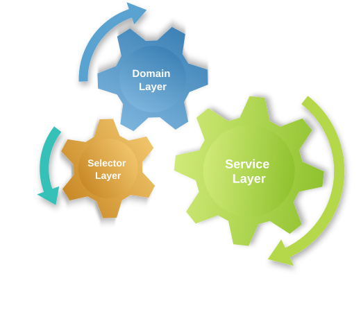
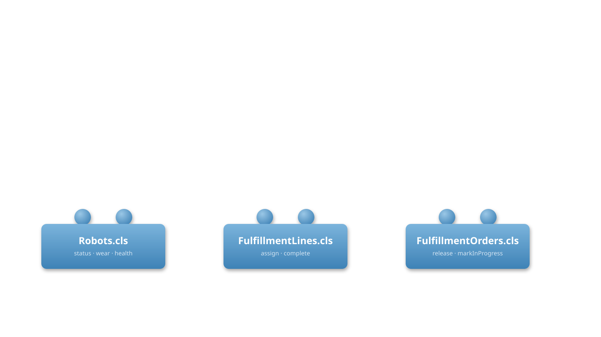
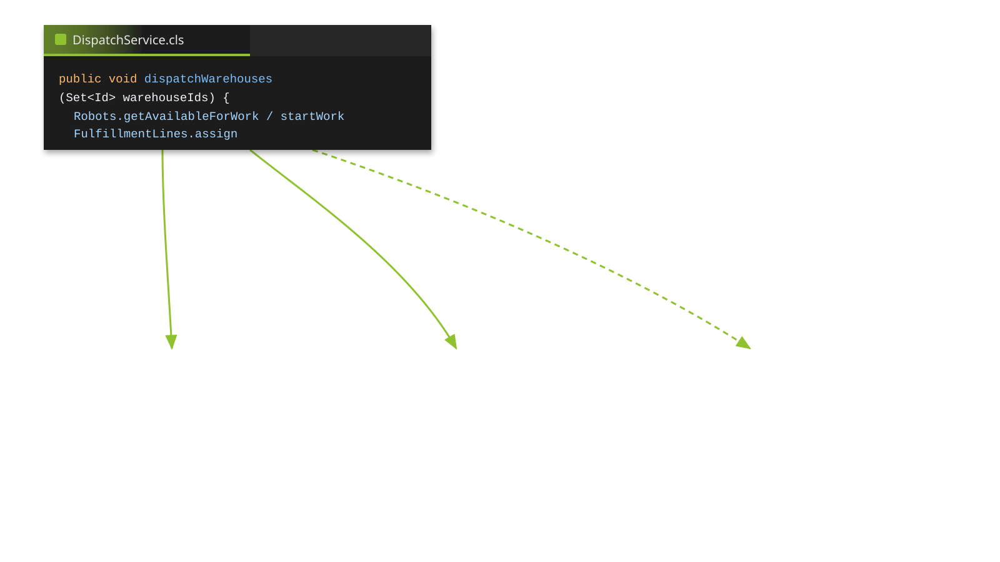
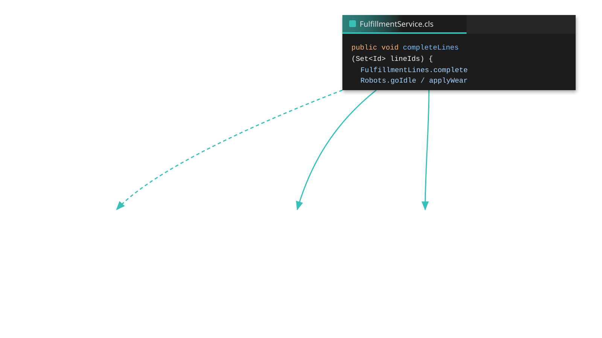
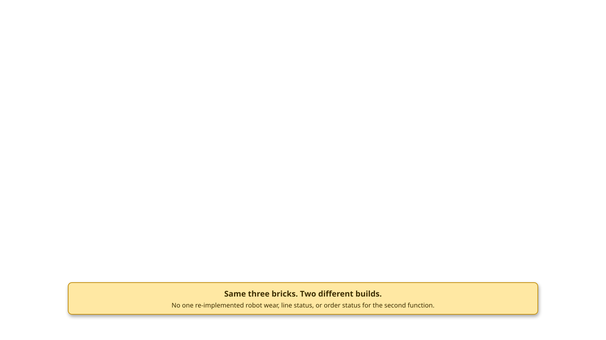
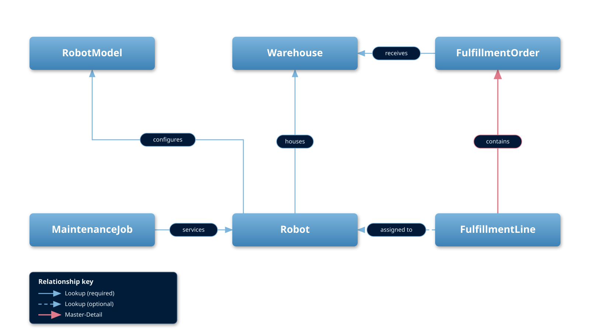
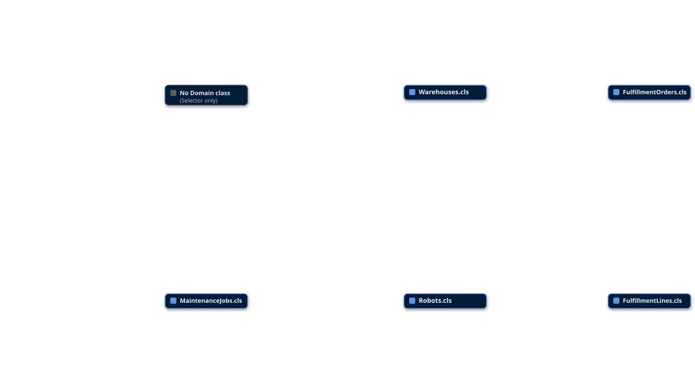
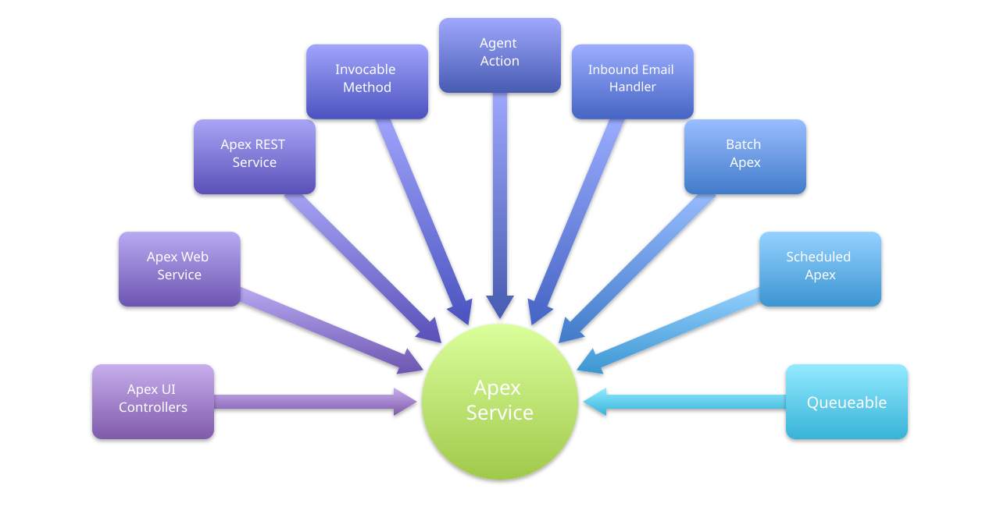

<!-- _class: title-slide -->

# Domain vs Service
### Where does my trigger logic go, and what do I put in a domain class vs a service class?
#### FFLib Series · Session 003

#### John M. Daniel
###### Code With Sally


---

<!-- _class: detail-slide about-slide -->

<div class="about-split">
<div class="about-copy">

# About me

##### Senior Director of Digital Platforms, Steampunk, Inc. | Apex Enterprise Patterns Maintainer & Architect

* **Apex Enterprise Patterns (fflib) maintainer & architect** — steward of `fflib-apex-common`, `fflib-apex-mocks`, `force-di`, and `AT4DX` at github.com/apex-enterprise-patterns
* **Open source education** — promoting awareness and adoption of Domain, Service, and Selector patterns for enterprise Salesforce development
* **Senior Director, Digital Platforms** — leading Salesforce platform engineering standards and delivery at Steampunk, Inc.

<!-- -->

* When I am not working on Apex architecture, I am probably driving my Jeep on the beach.

</div>
<div class="about-aside">
<a class="about-book">

</a>
</div>
</div>

<!--
TODO: Confirm the role-specific bullet and personal closing line; supply a logo and a photo/book image for the aside panel (parallels Andrew Fawcett's AndyInTheCloud logo + book cover in Sessions 001/002). GitHub: @ImJohnMDaniel.
-->

---

<!-- _class: detail-slide series-slide -->

# FFLib Series

<table>
<thead>
<tr><th></th><th>Session</th></tr>
</thead>
<tbody>
<tr class="done"><td><span class="check">✅</span></td><td>Session #1 — Separation of Concerns in Apex: Why Your Future Self Will Thank You</td></tr>
<tr class="done"><td><span class="check">✅</span></td><td>Session #2 — Service Layers Explained: Coordinating Business Logic in Apex</td></tr>
<tr class="current"><td><span class="check"></span></td><td>Session #3 — Domain vs Service: Where Should Your Apex Logic Live?</td></tr>
<tr><td><span class="check"></span></td><td>Session #4 — Query Logic as a First-Class Architecture Concern</td></tr>
<tr><td><span class="check"></span></td><td>Session #5 — Mocking in Apex: Why It Changes Everything</td></tr>
<tr><td><span class="check"></span></td><td>Session #6 — Enterprise-Scale Apex Across Multiple Packages</td></tr>
</tbody>
</table>

---

<!-- _class: detail-slide quote-slide service-quote-slide -->

# Domain Layer

<blockquote>
A single instance that handles the business logic for all rows in a database table or view.
</blockquote>

<p class="quote-source"><a href="https://martinfowler.com/eaaCatalog/tableModule.html">Martin Fowler — Table Module</a> — <em>Patterns of Enterprise Application Architecture</em></p>

<div class="service-layer-band">
  
</div>

<!--
Deliberate: we call this the Domain layer, but structurally it is Fowler's Table Module, not Domain Model — one class per SObject "table" (Robots.cls / Robot__c), a single instance handling a whole record set in bulk (Robots.newInstance(records)), no per-row object graph. Apex's governor limits rule out a true Domain Model's live, freely-navigable object graph. The Domain layer keeps Domain Model's spirit — behavior colocated with the entity type — while adopting Table Module's shape. Worth narrating: this is why "Domain" methods take a Unit of Work and loop over getRecords() instead of acting like one-object-per-row.
-->

---

<!-- _class: detail-slide checklist-slide -->

# Domain vs Service



<ul class="checklist">
<li>Domain vs Service</li>
<li class="current">Recap - Service Layer<span class="check"></span></li>
<li>Domain Principles<span class="check"></span></li>
<li>Warehouse App Objects and Behaviors<span class="check"></span></li>
<li>Warehouse App Domain vs Trigger Code<span class="check"></span></li>
</ul>

<!-- Pattern section: Domain for Session 003. For another session, use Selector Principles or [Other] Principles and replace the overview/checklist slides. -->

---

<!-- _class: detail-slide promises-slide -->

# Recap - Service Layer

* **Task-oriented** — a Service represents a feature; its methods expose business tasks.
  * `DispatchService.dispatchWarehouses(...)`
* **Reusable entry point** — LWC, REST, Flow, Agent actions, and Batch call the same Service.
* **Coordinates the work** — Selectors query; Domains apply object-specific behavior.
* **Owns the transaction** — create a Unit of Work, register changes, then commit once.

<!-- Source: Session 002, Service Task Orientated Logic, Services have many Consumers, Consumers and Dependencies, and Leveraging Unit of Work. -->

---

<!-- _class: detail-slide diagram-slide -->

# Who can call whom


---

<!-- _class: detail-slide callers-table-slide -->

# Who can call whom

<table>
<thead>
<tr><th>Caller</th><th><span class="layer-pill layer-pill-service">Service</span></th><th><span class="layer-pill layer-pill-domain">Domain</span></th><th><span class="layer-pill layer-pill-selector">Selector</span></th></tr>
</thead>
<tbody>
<tr><td><span class="layer-pill layer-pill-client">Client</span> (LWC, REST, Flow, Agent, Batch, ...)</td><td>●</td><td></td><td>●</td></tr>
<tr><td><span class="layer-pill layer-pill-handler">Trigger Handler</span></td><td>●</td><td>●</td><td>●</td></tr>
<tr><td><span class="layer-pill layer-pill-service">Service</span></td><td>●</td><td>●</td><td>●</td></tr>
<tr><td><span class="layer-pill layer-pill-domain">Domain</span></td><td></td><td>●</td><td>●</td></tr>
<tr><td><span class="layer-pill layer-pill-selector">Selector</span></td><td></td><td></td><td>●</td></tr>
</tbody>
</table>

---

<!-- _class: detail-slide checklist-slide -->

# Domain vs Service


<ul class="checklist">
<li>Domain vs Service</li>
<li>Recap - Service Layer<span class="check">✅</span></li>
<li class="current">Domain Principles<span class="check"></span></li>
<li>Warehouse App Objects and Behaviors<span class="check"></span></li>
<li>Warehouse App Domain vs Trigger Code<span class="check"></span></li>
</ul>

<!-- Pattern section: Domain for Session 003. For another session, use Selector Principles or [Other] Principles and replace the overview/checklist slides. -->

---

<!-- _class: detail-slide service-layer-def-slide -->

# Domain classes are like Lego bricks

<div class="service-layer-graphic lego-reveal">
  
  
  
  
</div>

<!--
Click 1: the three domain bricks appear — Robots, FulfillmentLines, FulfillmentOrders. A domain class is a collection of business logic around one object — a Lego brick.
Click 2: DispatchService.dispatchWarehouses appears, snapping all three bricks together for its build.
Click 3: FulfillmentService.completeLines appears, snapping the same three bricks together differently for a different build.
Click 4: the caption lands. Need a different function next? Reuse the same bricks; don't recast them.
-->

---

<!-- _class: detail-slide domain-logic-slide -->

# Domain ➡️ Object Orientated Logic

* A Domain class combines **data and behavior** of an object — one Lego brick
  * Robots — `Robots.newInstance(List<Robot__c> robots)`
  * Fulfillment Orders — `FulfillmentOrders.newInstance(List<FulfillmentOrder__c> orders)`
  * Base domain classes extend `fflib_SObjects` — no trigger plumbing required
* **Methods** are ways to interact with the object's behaviors — `robots.startWork(uow)`, `fulfillmentLines.complete(uow)`
* Trigger / CRUD responses are a **separate concern** in this sample
  * A **sidecar handler** class extends `fflib_SObjectDomain` — `RobotsTriggerHandler`
  * Wired from a thin trigger — `fflib_SObjectDomain.triggerHandler(RobotsTriggerHandler.class)`

<!--
Domain is data plus behavior — the reusable brick. Methods are the object's tasks. This sample keeps the two concerns in separate classes: Robots (fflib_SObjects) owns object behavior; RobotsTriggerHandler (fflib_SObjectDomain) owns the trigger-context responses. Combining them in one class is also valid — see the Evolved slide.
-->

---

<!-- _class: detail-slide promises-slide -->

# Domain ☑️ Checklist

* Record collections — wrap many records, not one
  * ✅ `Robots.newInstance(List<Robot__c> robots)`
  * ❌ `Robots.newInstance(Robot__c robot)`
* In-memory behavior, registered not committed — no direct DML
  * ✅ `void startWork(fflib_SObjectUnitOfWork uow)`
  * ❌ `void startWork() { update robots; }`
* **Records encapsulated** — don't have callers pass them in
  * ✅ `robots.startWork(uow)`
  * ❌ `startWork(Robot__c robot, uow)`
* **Trigger logic** — optional sidecar handler, e.g. `RobotsTriggerHandler`
* **Object-oriented** — data and behavior stay together — the reusable brick
* **Security** — SOQL and DML are user mode, unless Apex Trigger context

<!--
Robots wraps a list via newInstance. startWork mutates status in memory and registers dirty on the caller's uow — no direct DML inside the Domain. Methods use the encapsulated records — callers do not pass them in. Trigger CRUD moved to the optional RobotsTriggerHandler sidecar in this sample. SOQL and DML stay user mode unless Apex Trigger context.
-->

---

<!-- _class: detail-slide promises-slide service-evolution-slide -->

# Domain 🔁 Evolved

* **Domains can be just behavior** — operation methods only, no CRUD plumbing required
  * ✅ `Robots.cls extends fflib_SObjects` — `startWork`, `goIdle`, `applyWear`
  * ❌ One class handling both business rules and every trigger event
* **Sidecar trigger handlers** — fine for object logic tied to CRUD
  * ✅ `RobotsTriggerHandler.cls extends fflib_SObjectDomain` — `onApplyDefaults`, `onValidate`, `onBeforeUpdate`
  * ❌ Defaulting and validation logic duplicated inside the Domain and the trigger
* **Combined domains** — still fine if a class does both; this sample chooses the split for clarity

<p class="session-callout" data-marpit-fragment><span class="info-mark">ⓘ</span> <strong>Application class</strong><span class="session-callout-sub">Optional — this sample uses concrete <code>newInstance()</code> factories and a <code>@TestVisible</code> mock, no <code>Application</code> factory required.</span></p>

<!--
Same relaxations covered in Session 001's fflib evolution slide, now made concrete: this sample actually splits Robots (behavior) from RobotsTriggerHandler (CRUD sidecar) rather than combining them. Either choice is valid — pick one and be consistent per object.
Click: the Application class callout appears last, after the three evolution bullets are already on screen.
-->

---

<!-- _class: detail-slide code-slide pair-code-slide service-ide-slide -->

# Domain — Code Example 1

<div class="vscode">
<div class="vscode-tabs"><span class="vscode-tab vscode-tab-domain">Robots.cls</span></div>

```apex
public virtual inherited sharing class Robots extends fflib_SObjects {

  ...

  @TestVisible
  private static Robots mock;

  public static Robots newInstance(List<Robot__c> recordList) {
    return mock != null ? mock : new Robots(recordList);
  }

  public Robots(List<Robot__c> sObjectList) {
    super(sObjectList == null ? new List<Robot__c>() : sObjectList);
  }
```

</div>

<!--
Robots.cls, lines 1-4 and 34-52. Declaration: a Domain extends fflib_SObjects, no trigger plumbing. Then the brick's factory: newInstance wraps the records; a @TestVisible mock lets tests substitute the whole Domain, including mid-method construction (see DispatchService, which builds Robots(robotsToStart) after matching).
-->

---

<!-- _class: detail-slide code-slide pair-code-slide service-ide-slide -->

# Domain — Code Example 2

<div class="vscode">
<div class="vscode-tabs"><span class="vscode-tab vscode-tab-domain">Robots.startWork</span></div>

```apex
public virtual void startWork(fflib_SObjectUnitOfWork uow) {
  for (Robot__c robot : (List<Robot__c>) getRecords()) {
    // criteria
    if (!canAcceptWork(robot)) {
      throw new RobotsException(
        'Robot ' + robot.Name + ' cannot accept work.'
      );
    }
    // action 
    robot.Status__c = STATUS_WORKING;
    registerStatusDirty(uow, robot);
  }
}
```

</div>

<!--
Object-specific behavior: Idle to Working. Validates canAcceptWork per robot, mutates in memory, registers a minimal dirty record on the caller's uow. No DML here — the Service commits once via uow.commitWork().
-->

---

<!-- _class: detail-slide code-slide compact-code-slide pair-code-slide service-ide-slide -->

# Domain — Code Example 3

<div class="vscode">
<div class="vscode-tabs"><span class="vscode-tab vscode-tab-service">DispatchService.dispatchWarehouses</span></div>

```apex
public virtual void dispatchWarehouses(Set<Id> warehouseIds) {
  fflib_SObjectUnitOfWork uow = UnitOfWork.newInstance();
  ...
  List<FulfillmentLine__c> pending =
      lineSelector.selectPendingUnassignedByWarehouseWithOrder(warehouseIds);

  List<Robot__c> idle = robotSelector.selectIdleByWarehouseWithModel(warehouseIds);

  // Robot domain: keep only robots that can legally accept work
  List<Robot__c> available = Robots.newInstance(idle).getAvailableForWork();

  Map<Id, Id> robotIdByLineId = match(pending, available);
  ...
  Set<Id> assignedRobotIds = new Set<Id>(robotIdByLineId.values());

  List<Robot__c> robotsToStart = new List<Robot__c>();
  for (Robot__c robot : available) {
    if (assignedRobotIds.contains(robot.Id)) {
      robotsToStart.add(robot);
    }
  }

  Robots.newInstance(robotsToStart).startWork(uow);
  ...
  FulfillmentLines.newInstance(linesToAssign).assign(robotIdByLineId, uow);
```

</div>

<!--
The Service is the builder: it loads records through Selectors, then snaps two different bricks together — Robots and FulfillmentLines — for this build. FulfillmentService.completeLines snaps the same two bricks together differently, for a different build. Nothing about Robot status logic was reinvented.
-->

---

<!-- _class: detail-slide checklist-slide -->

# Domain vs Service


<ul class="checklist">
<li>Domain vs Service</li>
<li>Recap - Service Layer<span class="check">✅</span></li>
<li>Domain Principles<span class="check">✅</span></li>
<li class="current">Warehouse App Objects and Behaviors<span class="check"></span></li>
<li>Warehouse App Domain vs Trigger Code<span class="check"></span></li>
</ul>

<!-- Pattern section: Domain for Session 003. For another session, use Selector Principles or [Other] Principles and replace the overview/checklist slides. -->

---

<!-- _class: detail-slide diagram-slide -->

# Warehouse App — Domain Objects

<div class="diagram-stack">
  
  
</div>

<!--
High-level ERD of the six objects behind this app's Domain classes: Warehouses, Robots (+ RobotModel), FulfillmentOrders, FulfillmentLines, MaintenanceJobs — one Domain class per object, same Table Module framing from the Domain Layer definition slide. Robot sits in the middle: it's referenced by FulfillmentLine (optional — AssignedRobot__c) and MaintenanceJob (required), and itself references Warehouse and RobotModel. FulfillmentOrder to FulfillmentLine is the one Master-Detail relationship in the app; everything else is a Lookup.
Click: overlays which Domain class owns each object. RobotModel has none — it's config/reference data queried through RobotModelsSelector directly, not wrapped in behavior. Reinforces the Table Module point: one class per object, not per row.
-->

---

<!-- _class: detail-slide checklist-slide -->

# Domain vs Service


<ul class="checklist">
<li>Domain vs Service</li>
<li>Recap - Service Layer<span class="check">✅</span></li>
<li>Domain Principles<span class="check">✅</span></li>
<li>Warehouse App Objects and Behaviors<span class="check">✅</span></li>
<li class="current">Warehouse App Domain vs Trigger Code<span class="check"></span></li>
</ul>

<!-- Pattern section: Domain for Session 003. For another session, use Selector Principles or [Other] Principles and replace the overview/checklist slides. -->

---

<!-- _class: detail-slide code-slide duo-slide domain-examples-slide -->

# Trigger Handlers vs Domain

<div class="duo">
<div class="duo-col" data-marpit-fragment>
<p class="dev-caption">Service Layer → Domain</p>
<div class="vscode">
<div class="vscode-tabs"><span class="vscode-tab vscode-tab-domain">Robots.cls</span></div>

```apex
public virtual inherited sharing class Robots
    extends fflib_SObjects {

  public virtual void startWork(
      fflib_SObjectUnitOfWork uow)
  public virtual void goIdle(
      fflib_SObjectUnitOfWork uow)
  public virtual void applyWear(
      Map<Id, Decimal> hoursByRobotId,
      fflib_SObjectUnitOfWork uow)
  public virtual List<Robot__c> getAvailableForWork()
}
```

</div>
</div>
<div class="duo-col-stack">
<div class="duo-col" data-marpit-fragment>
<p class="dev-caption">Apex Trigger → Trigger Handler → Domain</p>
<div class="vscode">
<div class="vscode-tabs"><span class="vscode-tab vscode-tab-handler">RobotsTriggerHandler.cls</span></div>

```apex
public inherited sharing class RobotsTriggerHandler
    extends fflib_SObjectDomain {

  public override void onApplyDefaults()
  public override void onValidate(
      Map<Id, SObject> existingRecords)
  public override void onBeforeUpdate(
      Map<Id, SObject> existingRecords)
}
```

</div>
</div>
</div>
</div>

<div class="trigger-callout trigger-callout-south" data-marpit-fragment>Robots.cls (Domain) owns object behavior, callable any time. RobotsTriggerHandler.cls (sidecar) owns the trigger-context responses — defaults, validation — wired in by a one-line trigger.</div>

<div class="trigger-callout trigger-callout-north-right" data-marpit-fragment>Robots.trigger is one line: <code>fflib_SObjectDomain.triggerHandler(RobotsTriggerHandler.class)</code>. The handler only defaults, validates, and reacts to the trigger event.</div>

<!--
Real split from this sample, not a hypothetical. Robots (fflib_SObjects) is the reusable brick — no trigger plumbing. RobotsTriggerHandler (fflib_SObjectDomain) is the sidecar: onApplyDefaults sets Idle/0 wear/full battery, onValidate blocks illegal status transitions, onBeforeUpdate recalculates health when wear changes. DispatchService and FulfillmentService never call the handler — only the Domain.
Click order: 1) Service Layer → Domain column, 2) Apex Trigger → Trigger Handler → Domain column, 3) the top "Robots.cls (Domain) owns..." bubble, 4) the bottom "Robots.trigger is one line..." bubble. Visual position is restored via CSS order (flex column on section), independent of this click sequence.
PARKED-AND-MOVED: relocated here (after the Warehouse App Domain vs Trigger Code section boundary) from its original position in the Domain Principles section, per explicit request.
-->

---

<!-- _class: detail-slide checklist-slide -->

# Domain vs Service


<ul class="checklist">
<li>Domain vs Service</li>
<li>Recap - Service Layer<span class="check">✅</span></li>
<li>Domain Principles<span class="check">✅</span></li>
<li>Warehouse App Objects and Behaviors<span class="check">✅</span></li>
<li>Warehouse App Domain vs Trigger Code<span class="check">✅</span></li>
</ul>

<!-- Pattern section: Domain for Session 003. For another session, use Selector Principles or [Other] Principles and replace the overview/checklist slides. -->

---

<!-- _class: detail-slide series-slide -->

# What's Next — FFLib Series

<table>
<thead>
<tr><th></th><th>Session</th></tr>
</thead>
<tbody>
<tr class="done"><td><span class="check">✅</span></td><td>Session #1 — Separation of Concerns in Apex: Why Your Future Self Will Thank You</td></tr>
<tr class="done"><td><span class="check">✅</span></td><td>Session #2 — Service Layers Explained: Coordinating Business Logic in Apex</td></tr>
<tr class="done"><td><span class="check">✅</span></td><td>Session #3 — Domain vs Service: Where Should Your Apex Logic Live?</td></tr>
<tr class="current"><td><span class="check"></span></td><td>Session #4 — Query Logic as a First-Class Architecture Concern</td></tr>
<tr><td><span class="check"></span></td><td>Session #5 — Mocking in Apex: Why It Changes Everything</td></tr>
<tr><td><span class="check"></span></td><td>Session #6 — Enterprise-Scale Apex Across Multiple Packages</td></tr>
</tbody>
</table>

---

<!-- _class: title-slide -->

# Thank you!

#### John M. Daniel · Code With Sally
### FFLib Series · Session 003


---

<!-- _class: detail-slide -->

<!-- PARKING LOT — slides after this point are not part of the active deck flow. Held here for later reuse. -->

---

<!-- _class: detail-slide quote-slide service-quote-slide -->

# Where should your Apex logic live?

<blockquote>
One of the biggest challenges in Apex architecture is deciding where logic belongs. This session explores the responsibilities of domain classes, service classes, and triggers so you can build systems that are easier to understand, extend, and test.
</blockquote>

<p class="quote-source">Session abstract</p>

<!--
PARKED: previously slide 5, displaced when slide 5 became the Domain Layer / Table Module definition slide. Held here until a new home is found for the abstract text.
-->

---

<!-- _class: detail-slide diagram-slide color-key-slide -->

# Apex Enterprise Patterns (fflib) - Color Chart

<div class="color-key-split">
<div class="color-key-cogs">

</div>
<div class="color-key-legends">
<div class="color-key-legend-stack">
<div class="color-key-legend"><span class="swatch swatch-client"></span>Client</div>
<div class="color-key-legend"><span class="swatch swatch-service"></span>Service</div>
<div class="color-key-legend"><span class="swatch swatch-domain"></span>Domain</div>
<div class="color-key-legend"><span class="swatch swatch-trigger"></span>Trigger Handler</div>
<div class="color-key-legend"><span class="swatch swatch-selector"></span>Selector</div>
</div>
</div>
</div>

<!--
PARKED: moved from slide 5 (original deck position, right after the Domain Layer definition slide) to the end of the deck.
-->

---

<!-- _class: detail-slide diagram-slide -->

# Services have many Consumers



<!--
PARKED: moved from slide 9 (original deck position, end of the Recap - Service Layer section) to the end of the deck.
-->

---

<!-- _class: detail-slide pair-code-slide service-ide-slide -->

# Warehouse App Objects and Behaviors

<div class="vscode">
<div class="vscode-tabs"><span class="vscode-tab vscode-tab-service">[ClassName.methodName]</span></div>
<div class="vscode-prose">
<p class="walk-sig walk-sig-start"><span class="walk-kw">public virtual void</span> [methodName]([parameters]) {</p>

1. <span class="walk-layer walk-layer-service">Service</span> — [Coordinate the operation]
2. <span class="walk-layer walk-layer-selector">Selector</span> — [Load the records]
3. <span class="walk-layer walk-layer-domain">Domain</span> — [Apply the object-specific behavior]
4. <span class="walk-layer walk-layer-service">Service</span> — [Complete the transaction]

<p class="walk-sig walk-sig-end">}</p>
</div>
</div>

<!--
TODO: Replace the signature and walkthrough steps.
PARKED: moved from slide 20 (middle of the Warehouse App Objects and Behaviors section) to the end of the deck.
-->

---

<!-- _class: detail-slide code-slide pair-code-slide service-ide-slide dispatch-gutter-slide -->

# Warehouse App Objects and Behaviors

<div class="vscode">
<div class="vscode-tabs"><span class="vscode-tab vscode-tab-service">[ClassName.methodName]</span></div>

```apex
// [Paste the focused Apex example here.]
//
// [Introduce the records or inputs.]
// [Show the behavior this section explains.]
// [Highlight the important decision.]
```

</div>

<!--
TODO: Replace the example. Keep the inherited IDE frame and layer-colored tab.
PARKED: moved from slide 20 (end of the Warehouse App Objects and Behaviors section) to the end of the deck.
-->

---

<!-- _class: detail-slide diagram-slide -->

# Warehouse App Domain vs Trigger Code

<div class="template-image">[Diagram / Illustration]</div>

<!--
TODO: Replace this placeholder with the section visual.
PARKED: moved from slide 22 (start of the Warehouse App Domain vs Trigger Code section) to the end of the deck.
-->

---

<!-- _class: detail-slide code-slide pair-code-slide service-ide-slide dispatch-gutter-slide -->

# Warehouse App Domain vs Trigger Code

<div class="vscode">
<div class="vscode-tabs"><span class="vscode-tab vscode-tab-service">[ClassName.methodName]</span></div>

```apex
// [Paste the focused Apex example here.]
//
// [Introduce the records or inputs.]
// [Show the behavior this section explains.]
// [Highlight the important decision.]
```

</div>

<!--
TODO: Replace the example. Keep the inherited IDE frame and layer-colored tab.
PARKED: moved from slide 23 (middle of the Warehouse App Domain vs Trigger Code section) to the end of the deck.
-->

---

<!-- _class: detail-slide promises-slide -->

# Warehouse App Domain vs Trigger Code

* **[Scenario one]**
  * [Question for the audience]
* **[Scenario two]**
  * [Question for the audience]
* **[Discussion takeaway]**
  * [Reveal or summarize the reasoning]

<!--
TODO: Replace the discussion prompts.
PARKED: moved from slide 24 (end of the Warehouse App Domain vs Trigger Code section) to the end of the deck.
-->

---

<!-- _class: detail-slide promises-slide -->

# Warehouse App Objects and Behaviors

* **[Principle one]**
  * ✅ [Example that follows the principle]
  * ❌ [Example to avoid]
* **[Principle two]**
  * ✅ [Example that follows the principle]
  * ❌ [Example to avoid]
* **[Principle three]** — [Short explanation]

<!--
TODO: Replace the bracketed content. Use the inherited checklist layout.
PARKED: moved from slide 19 (Warehouse App Objects and Behaviors section) to the end of the deck.
-->

