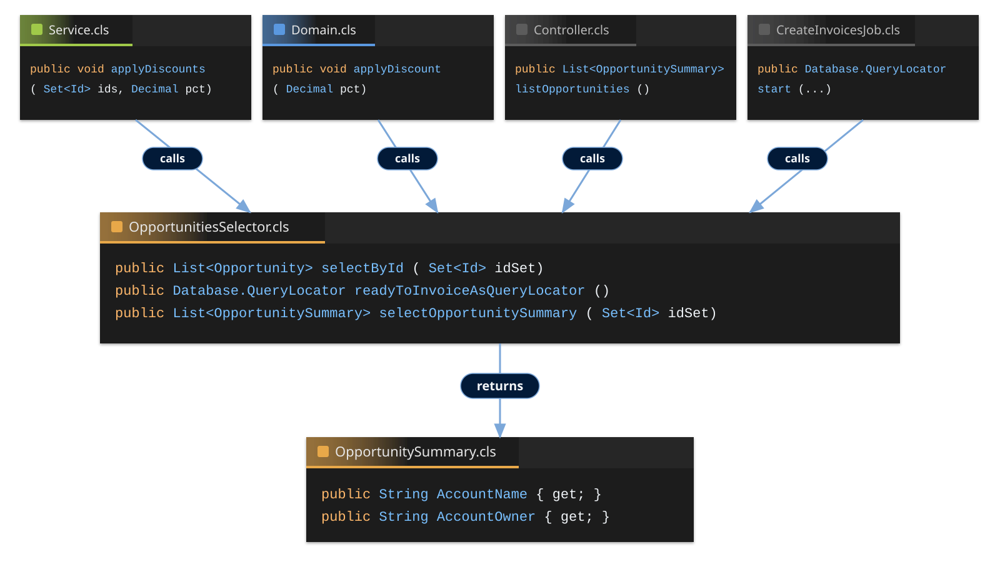

<!-- _class: title-slide -->

# Query Logic as a First-Class Architecture Concern
### The Role of the Selector Layer
#### FFLib Series · Session 004

#### [Name]
###### [Organisation]

<div class="template-logo">[Logo]</div>

---

<!-- _class: detail-slide about-slide -->

<div class="about-split">
<div class="about-copy">

# About me

##### [Role] | [Organisation] | [Previous Role]

* **[Area of Expertise]** — [Short description]
* **[Experience or Achievement]** — [Short description]
* **[How I Help]** — [Short description]

<!-- -->

* [Personal introduction or closing statement]

</div>
<div class="about-aside">
<div class="about-logo-wrap">
<div class="template-logo">[Organisation Logo]</div>
</div>
<div class="about-book template-image">[Photo / Book / Project Image]</div>
</div>
</div>

---

<!-- _class: detail-slide series-slide -->

# FFLib Series

<table>
<thead>
<tr><th></th><th>Session</th></tr>
</thead>
<tbody>
<tr class="done"><td><span class="check">✅</span></td><td>Session #1 — Separation of Concerns in Apex: Why Your Future Self Will Thank You</td></tr>
<tr class="done"><td><span class="check">✅</span></td><td>Session #2 — Service Layers Explained: Coordinating Business Logic in Apex</td></tr>
<tr class="done"><td><span class="check">✅</span></td><td>Session #3 — Domain vs Service: Where Should Your Apex Logic Live?</td></tr>
<tr class="current"><td><span class="check"></span></td><td>Session #4 — Query Logic as a First-Class Architecture Concern</td></tr>
<tr><td><span class="check"></span></td><td>Session #5 — Mocking in Apex: Why It Changes Everything</td></tr>
<tr><td><span class="check"></span></td><td>Session #6 — Enterprise-Scale Apex Across Multiple Packages</td></tr>
</tbody>
</table>

---

<!-- _class: detail-slide service-layer-def-slide -->

# Query Logic as a First-Class Architecture Concern

<div class="service-layer-graphic">
  <div class="template-image">[Session Opening Image]</div>
</div>

<!-- TODO: Replace the image with the opening idea for this session. -->

---

<!-- _class: detail-slide quote-slide service-quote-slide -->

# Selector Layer

<blockquote>
[Add a short definition or statement that introduces query logic as architecture — not just SOQL.]
</blockquote>

<p class="quote-source">[Author / source, if quoting]</p>


<!-- TODO: Add the session definition; cite the source if using a quotation. -->

---

<!-- _class: detail-slide diagram-slide color-key-slide -->

# Apex Enterprise Patterns (fflib) - Color Chart

<div class="color-key-split">
<div class="color-key-cogs">

</div>
<div class="color-key-legends">
<div class="color-key-legend-stack">
<div class="color-key-legend"><span class="swatch swatch-client"></span>Client</div>
<div class="color-key-legend"><span class="swatch swatch-service"></span>Service</div>
<div class="color-key-legend"><span class="swatch swatch-domain"></span>Domain</div>
<div class="color-key-legend"><span class="swatch swatch-trigger"></span>Trigger Handler</div>
<div class="color-key-legend"><span class="swatch swatch-selector"></span>Selector</div>
</div>
</div>
</div>

---

<!-- _class: detail-slide checklist-slide -->

# Query Logic as a First-Class Architecture Concern


<ul class="checklist">
<li>Query Logic as a First-Class Architecture Concern</li>
<li class="current">Installing FFLib<span class="check"></span></li>
<li>Recap - Domain Layer<span class="check"></span></li>
<li>Selector Principles<span class="check"></span></li>
<li>Warehouse App Query Logic<span class="check"></span></li>
<li>Warehouse App Selectors vs Inline SOQL<span class="check"></span></li>
</ul>

<!-- Pattern section: Installing FFLib, then Domain recap from Session 003, then Selector. -->

---

<!-- _class: detail-slide promises-slide install-fflib-slide -->

# [apex-enterprise-patterns](https://github.com/apex-enterprise-patterns)

<p class="org-link"><a href="https://github.com/apex-enterprise-patterns">https://github.com/apex-enterprise-patterns</a></p>

* **`fflib-apex-common`** — Service, Domain, Selector, Unit of Work
* **`fflib-apex-common-samplecode`** — sample application illustrating the library
* **`fflib-apex-mocks`** — Stub API for isolated tests *
* **`force-di`** — metadata-driven dependency injection *
* **`at4dx`** — Advanced Techniques for Salesforce DX / multi-package *

<p class="session-callout"><span class="info-mark">ⓘ</span> * Covered in later sessions<span class="session-callout-sub"><strong>Session #5</strong> — Mocking in Apex: <code>fflib-apex-mocks</code></span><span class="session-callout-sub"><strong>Session #6</strong> — Enterprise-Scale Apex: <code>force-di</code> and <code>at4dx</code></span></p>

<!--
The GitHub org is more than apex-common. Open https://github.com/apex-enterprise-patterns. This session only needs common (and mocks to deploy the sample). Mocks teaching is Session 5. force-di and AT4DX are Session 6.
-->

---

<!-- _class: detail-slide code-slide pair-code-slide service-ide-slide install-fflib-slide -->

# Installing FFLib — `fflib-apex-common`

<div class="vscode">
<div class="vscode-tabs"><span class="vscode-tab">sfdx-source</span></div>

```text
fflib-apex-common/
└── sfdx-source/
    └── apex-common/
        ├── main/
        │   ├── classes/
        │   │   ├── fflib_SObjectDomain.cls
        │   │   ├── fflib_SObjectSelector.cls
        │   │   ├── fflib_SObjectUnitOfWork.cls
        │   │   ├── fflib_Application.cls
        │   │   └── …
        │   └── labels/
        └── test/
            └── classes/
```

</div>

<!--
The library ships as Salesforce DX source under sfdx-source/apex-common — that is the folder we deploy. Highlight Domain, Selector, and Unit of Work as the core pattern classes.
-->

---

<!-- _class: detail-slide code-slide pair-code-slide service-ide-slide install-fflib-slide -->

# Installing FFLib — Deploy

<div class="vscode">
<div class="vscode-tabs"><span class="vscode-tab">Terminal</span></div>

```bash
# Apex Common — Service, Domain, Selector, Unit of Work
git clone \
  https://github.com/apex-enterprise-patterns/fflib-apex-common.git \
  fflib-apex-common
sf project deploy start \
  --source-dir fflib-apex-common/sfdx-source/apex-common

# Apex Mocks — Stub API for isolated unit tests
git clone \
  https://github.com/apex-enterprise-patterns/fflib-apex-mocks.git \
  fflib-apex-mocks
sf project deploy start \
  --source-dir fflib-apex-mocks/sfdx-source/apex-mocks

# Official sample app — illustrates the library
git clone \
  https://github.com/apex-enterprise-patterns/fflib-apex-common-samplecode.git \
  fflib-apex-common-samplecode
sf project deploy start \
  --source-dir fflib-apex-common-samplecode/sfdx-source/apex-common-samplecode

# Warehouse Operations — this session's app, already in the project
sf project deploy start \
  --source-dir force-app
```

</div>

<!--
Clone each library into a subdirectory, then deploy from that path — no cd. Common first. Mocks is not a dependency. Then the official sample app. Finally deploy force-app from this session; no clone needed.
-->

---

<!-- _class: detail-slide checklist-slide -->

# Query Logic as a First-Class Architecture Concern


<ul class="checklist">
<li>Query Logic as a First-Class Architecture Concern</li>
<li>Installing FFLib<span class="check">✅</span></li>
<li class="current">Recap - Domain Layer<span class="check"></span></li>
<li>Selector Principles<span class="check"></span></li>
<li>Warehouse App Query Logic<span class="check"></span></li>
<li>Warehouse App Selectors vs Inline SOQL<span class="check"></span></li>
</ul>

<!-- Pattern section: Selector for Session 004. Recap is Domain from Session 003. -->

---

<!-- _class: detail-slide domain-logic-slide -->

# Domain ➡️ Object Orientated Logic

* A Domain class combines **data and behavior** of an object
  * Opportunities — `Opportunities.newInstance(List<Opportunity> opportunities)`
  * Accounts — `Accounts.newInstance(List<Account> accounts)`
  * Base domain classes include common behaviors — `AbstractChargeable`
  * Top level domain classes extend — `TrainingWorkItems.cls`, `DeveloperWorkItems.cls`
* **Methods** are ways to interact with the object's behaviors, `opportunities.applyDiscount`, `workItem.updateCostOfHoursWorked`
* Additional **methods** can respond to data manipulation scenarios (Triggers), `opportunities.onBeforeUpdate`, `opportunities.onValidate`
  * Or can be split into a **sidecar handler** class if you prefer, `new OpportunitiesTriggerHandler().onBeforeUpdate`

<!--
Recap from Session 003. Domain is data plus behavior. Methods are the object's tasks. Trigger / CRUD responses can live on the Domain, or in a sidecar handler.
-->

---

<!-- _class: detail-slide promises-slide -->

# Domain ☑️ Checklist

* Record collections — wrap many records, not one
  * ✅ `Opportunities.newInstance(List<Opportunity> opportunities)`
  * ❌ `Opportunities.newInstance(Opportunity opportunity)`
* In-memory behavior — mutate records; no DML
  * ✅ `void applyDiscount(Decimal discountPercentage)`
  * ❌ `void applyDiscount() { update records; }`
* **Records encapsulated** — don't have callers pass them in
  * ✅ `opportunities.applyDiscount(10)`
  * ❌ `applyDiscount(Opportunity opportunity)`
* **Trigger logic** — Optional trigger handler sidecar class
* **Object-oriented** — data and behavior stay together
* **Security** — SOQL and DML are user mode, unless Apex Trigger context

<!--
Recap from Session 003. Domain wraps a list via newInstance. applyDiscount mutates in memory; Service or Handler commits via getRecords.
-->

---

<!-- _class: detail-slide diagram-slide -->

# Who can call whom


---

<!-- _class: detail-slide callers-table-slide -->

# Who can call whom

<table>
<thead>
<tr><th>Caller</th><th><span class="layer-pill layer-pill-service">Service</span></th><th><span class="layer-pill layer-pill-domain">Domain</span></th><th><span class="layer-pill layer-pill-selector">Selector</span></th></tr>
</thead>
<tbody>
<tr><td><span class="layer-pill layer-pill-client">Client</span> (LWC, REST, Flow, Agent, Batch, ...)</td><td>●</td><td></td><td>●</td></tr>
<tr><td><span class="layer-pill layer-pill-handler">Trigger Handler</span></td><td>●</td><td>●</td><td>●</td></tr>
<tr><td><span class="layer-pill layer-pill-service">Service</span></td><td>●</td><td>●</td><td>●</td></tr>
<tr><td><span class="layer-pill layer-pill-domain">Domain</span></td><td></td><td>●</td><td>●</td></tr>
<tr><td><span class="layer-pill layer-pill-selector">Selector</span></td><td></td><td></td><td>●</td></tr>
</tbody>
</table>

---

<!-- _class: detail-slide checklist-slide -->

# Query Logic as a First-Class Architecture Concern


<ul class="checklist">
<li>Query Logic as a First-Class Architecture Concern</li>
<li>Installing FFLib<span class="check">✅</span></li>
<li>Recap - Domain Layer<span class="check">✅</span></li>
<li class="current">Selector Principles<span class="check"></span></li>
<li>Warehouse App Query Logic<span class="check"></span></li>
<li>Warehouse App Selectors vs Inline SOQL<span class="check"></span></li>
</ul>

<!-- Pattern section: Selector for Session 004. -->

---

<!-- _class: detail-slide -->

# Selector ➡️ SOQL is Logic

* A Selector class encapsulates **query complexity** and supports **reuse**
* **Discovery** — required query easy to discover with named methods, `readyToInvoiceAsQueryLocator`, `selectRecentlyUsed`
* **Consistency** — apply same fields, ordering unless overridden
  * Start with common fields, add as needed
* Typically **class per object** — `OpportunitiesSelector`, `AccountsSelector`
* Consider **class per group of queries** — `WarehouseHandlingSelector`
* **Reuse** across Service, Domain, handlers, and sometimes controllers

<!--
Named methods make the right query discoverable. Consistency is the same fields and order unless a method overrides them. Default is one selector per object; a feature-shaped selector is also valid when queries belong together.
-->

---

<!-- _class: detail-slide promises-slide -->

# Selector ☑️ Checklist

* Provide result ordering, and field consistency by default
* Name **what** is returned and **how** it is filtered
  * `selectByIdWithProducts`, `selectByOpportunity`, `readyToInvoiceAsQueryLocator`
* Methods can also **dereference relationships** for callers — e.g. `accountsSelector.selectByOpportunity(opportunities)`
* Elevation to system only when required, with overload, e.g.
  * `selectById(Set<Id> ids)`
  * `selectById(Set<Id> ids, Boolean systemMode)`
* Consider flattened data types to simplify consumption e.g. `List<OpportunitySummary> selectOpportunitySummary(Set<Id> idSet)`
* Selectors run in user mode by default

<!--
Method names are documentation. Default field list and ORDER BY keep results consistent unless a method overrides them. Selectors stay user mode via inherited sharing; elevate only through the systemMode overload.
-->

---

<!-- _class: detail-slide promises-slide service-evolution-slide -->

# Selector 🔁 Evolved

* **[Evolution Topic 1]** — [What has changed]
  * ✅ [Current approach and why it helps]
  * ❌ [Earlier approach or limitation]
* **[Evolution Topic 2]** — [What has changed]
  * ✅ [Current approach and why it helps]
  * ❌ [Earlier approach or limitation]
* **[Evolution Topic 3]** — [Guidance to explore]
  * [Example or supporting reference]

<p class="session-callout"><span class="info-mark">ⓘ</span> <strong>[Related Topic / Session]</strong><span class="session-callout-sub">[Optional follow-up or supporting reference]</span></p>

<!-- TODO: Decide which Selector changes to cover. Layout copied from Session 003's Domain Evolution slide; no recommendations asserted yet. -->

---

<!-- _class: detail-slide code-slide pair-code-slide service-ide-slide -->

# Selector — Code Example 1

<div class="vscode">
<div class="vscode-tabs"><span class="vscode-tab vscode-tab-selector">[SelectorClass.methodName]</span></div>

```apex
// [Show how the Selector names and reuses a query.]
//
// [Add the focused Apex example.]
// [Highlight the key behaviour.]
```

</div>

<!-- TODO: Replace the example. Keep the inherited IDE frame and layer-coloured tab. -->

---

<!-- _class: detail-slide code-slide pair-code-slide service-ide-slide -->

# Selector — Code Example 2

<div class="vscode">
<div class="vscode-tabs"><span class="vscode-tab vscode-tab-selector">[SelectorClass.methodName]</span></div>

```apex
// [Show field lists, ordering, or a QueryLocator.]
//
// [Add the focused Apex example.]
// [Highlight the key behaviour.]
```

</div>

<!-- TODO: Replace the example. Keep the inherited IDE frame and layer-coloured tab. -->

---

<!-- _class: detail-slide code-slide pair-code-slide service-ide-slide -->

# Selector — Code Example 3

<div class="vscode">
<div class="vscode-tabs"><span class="vscode-tab vscode-tab-selector">[SelectorClass.methodName]</span></div>

```apex
// [Show how a caller invokes the Selector.]
//
// [Add the focused Apex example.]
// [Highlight the key behaviour.]
```

</div>

<!-- TODO: Replace the example. Keep the inherited IDE frame and layer-coloured tab. -->

---

<!-- _class: detail-slide promises-slide -->

# Selector ➡️ Methods

* **Implement** — tell the base class what to query
  * `getSObjectType()` — the SObject this selector queries
  * `getSObjectFieldList()` — default fields used by every query
  * `getOrderBy()` — default ORDER BY (Name, else CreatedDate / Id)
* **Query** — reuse those defaults
  * `selectSObjectsById(idSet)` — SELECT default fields WHERE Id IN :idSet
  * `queryLocatorById(idSet)` — same query as a `QueryLocator` (Batch)
  * `newQueryFactory()` — `QueryFactory` with object, fields, fieldsets, and order
* **Compose** — related and child queries
  * `configureQueryFactoryFields(qf, path)` — add this selector's fields on a relationship
  * `addQueryFactorySubselect(parent)` — child subquery using this selector
* **Security** — `setDataAccess(USER_MODE)` or `SYSTEM_MODE`

<!--
fflib_SObjectSelector is the library base class. Subclasses implement type, fields, and optionally order. Call selectSObjectsById or newQueryFactory for custom WHERE clauses. Compose related fields and subselects instead of copying field lists. Prefer setDataAccess over the older CRUD/FLS flags.
-->

---

<!-- _class: detail-slide diagram-slide selector-consumers-slide -->

# Selector - Consumers and Dependencies



<!--
Service, Domain, Controller, and batch jobs all call the same Selector. Named methods document the query; callers do not copy SOQL.
-->

---

<!-- _class: detail-slide checklist-slide -->

# Query Logic as a First-Class Architecture Concern


<ul class="checklist">
<li>Query Logic as a First-Class Architecture Concern</li>
<li>Installing FFLib<span class="check">✅</span></li>
<li>Recap - Domain Layer<span class="check">✅</span></li>
<li>Selector Principles<span class="check">✅</span></li>
<li class="current">Warehouse App Query Logic<span class="check"></span></li>
<li>Warehouse App Selectors vs Inline SOQL<span class="check"></span></li>
</ul>

<!-- Pattern section: Selector for Session 004. -->

---

<!-- _class: detail-slide promises-slide -->

# Warehouse App Query Logic

* **[Principle one]**
  * ✅ [Example that follows the principle]
  * ❌ [Example to avoid]
* **[Principle two]**
  * ✅ [Example that follows the principle]
  * ❌ [Example to avoid]
* **[Principle three]** — [Short explanation]

<!-- TODO: Replace the bracketed content. Use the inherited checklist layout. -->

---

<!-- _class: detail-slide pair-code-slide service-ide-slide -->

# Warehouse App Query Logic

<div class="vscode">
<div class="vscode-tabs"><span class="vscode-tab vscode-tab-selector">[SelectorClass.methodName]</span></div>
<div class="vscode-prose">
<p class="walk-sig walk-sig-start"><span class="walk-kw">public virtual List&lt;SObject&gt;</span> [methodName]([parameters]) {</p>

1. <span class="walk-layer walk-layer-selector">Selector</span> — [Name the query and its filter]
2. <span class="walk-layer walk-layer-selector">Selector</span> — [Choose fields, related records, and order]
3. <span class="walk-layer walk-layer-service">Service</span> — [Consume the result without embedding SOQL]
4. <span class="walk-layer walk-layer-domain">Domain</span> — [Apply object-specific behaviour to the records]

<p class="walk-sig walk-sig-end">}</p>
</div>
</div>

<!-- TODO: Replace the signature and walkthrough steps. -->

---

<!-- _class: detail-slide code-slide pair-code-slide service-ide-slide dispatch-gutter-slide -->

# Warehouse App Query Logic

<div class="vscode">
<div class="vscode-tabs"><span class="vscode-tab vscode-tab-selector">[SelectorClass.methodName]</span></div>

```apex
// [Paste the focused Apex example here.]
//
// [Introduce the records or inputs.]
// [Show the query this section explains.]
// [Highlight the important decision.]
```

</div>

<!-- TODO: Replace the example. Keep the inherited IDE frame and layer-coloured tab. -->

---

<!-- _class: detail-slide checklist-slide -->

# Query Logic as a First-Class Architecture Concern


<ul class="checklist">
<li>Query Logic as a First-Class Architecture Concern</li>
<li>Installing FFLib<span class="check">✅</span></li>
<li>Recap - Domain Layer<span class="check">✅</span></li>
<li>Selector Principles<span class="check">✅</span></li>
<li>Warehouse App Query Logic<span class="check">✅</span></li>
<li class="current">Warehouse App Selectors vs Inline SOQL<span class="check"></span></li>
</ul>

<!-- Pattern section: Selector for Session 004. -->

---

<!-- _class: detail-slide diagram-slide -->

# Warehouse App Selectors vs Inline SOQL

<div class="template-image">[Diagram / Illustration]</div>

<!-- TODO: Replace this placeholder with the section visual. -->

---

<!-- _class: detail-slide code-slide pair-code-slide service-ide-slide dispatch-gutter-slide -->

# Warehouse App Selectors vs Inline SOQL

<div class="vscode">
<div class="vscode-tabs"><span class="vscode-tab vscode-tab-selector">[SelectorClass.methodName]</span></div>

```apex
// [Paste the focused Apex example here.]
//
// [Introduce the records or inputs.]
// [Show the query this section explains.]
// [Highlight the important decision.]
```

</div>

<!-- TODO: Replace the example. Keep the inherited IDE frame and layer-coloured tab. -->

---

<!-- _class: detail-slide promises-slide -->

# Warehouse App Selectors vs Inline SOQL

* **[Scenario one]**
  * [Question for the audience]
* **[Scenario two]**
  * [Question for the audience]
* **[Discussion takeaway]**
  * [Reveal or summarise the reasoning]

<!-- TODO: Replace the discussion prompts. -->

---

<!-- _class: detail-slide checklist-slide -->

# Query Logic as a First-Class Architecture Concern


<ul class="checklist">
<li>Query Logic as a First-Class Architecture Concern</li>
<li>Installing FFLib<span class="check">✅</span></li>
<li>Recap - Domain Layer<span class="check">✅</span></li>
<li>Selector Principles<span class="check">✅</span></li>
<li>Warehouse App Query Logic<span class="check">✅</span></li>
<li>Warehouse App Selectors vs Inline SOQL<span class="check">✅</span></li>
</ul>

<!-- Pattern section: Selector for Session 004. -->

---

<!-- _class: detail-slide series-slide -->

# What's Next — FFLib Series

<table>
<thead>
<tr><th></th><th>Session</th></tr>
</thead>
<tbody>
<tr class="done"><td><span class="check">✅</span></td><td>Session #1 — Separation of Concerns in Apex: Why Your Future Self Will Thank You</td></tr>
<tr class="done"><td><span class="check">✅</span></td><td>Session #2 — Service Layers Explained: Coordinating Business Logic in Apex</td></tr>
<tr class="done"><td><span class="check">✅</span></td><td>Session #3 — Domain vs Service: Where Should Your Apex Logic Live?</td></tr>
<tr class="done"><td><span class="check">✅</span></td><td>Session #4 — Query Logic as a First-Class Architecture Concern</td></tr>
<tr class="current"><td><span class="check"></span></td><td>Session #5 — Mocking in Apex: Why It Changes Everything</td></tr>
<tr><td><span class="check"></span></td><td>Session #6 — Enterprise-Scale Apex Across Multiple Packages</td></tr>
</tbody>
</table>

---

<!-- _class: title-slide -->

# Thank you!

#### Andrew Fawcett · Code With Sally
### FFLib Series · Session 004


